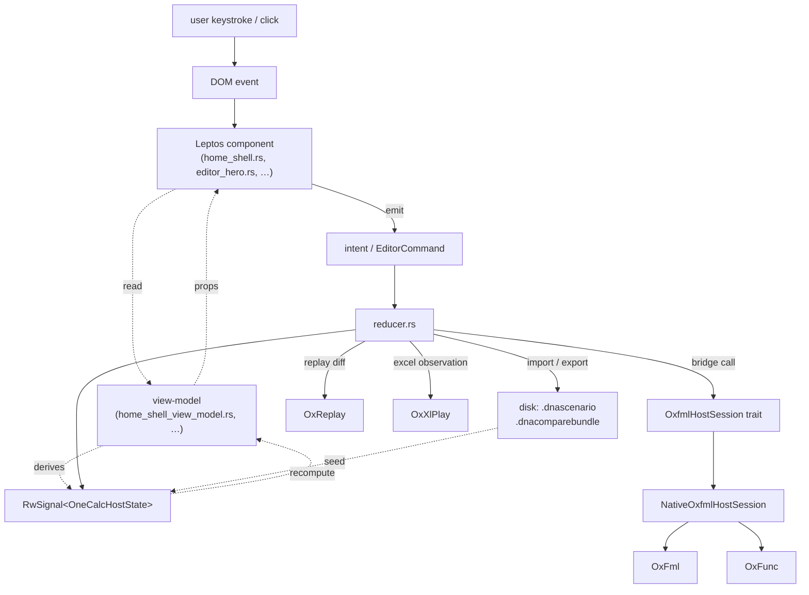
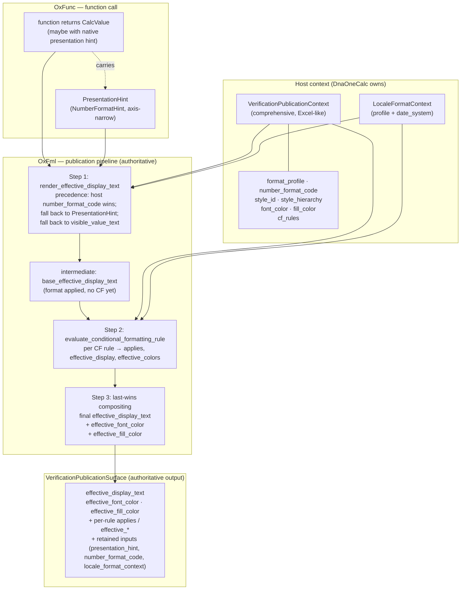
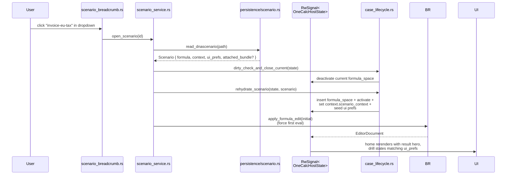
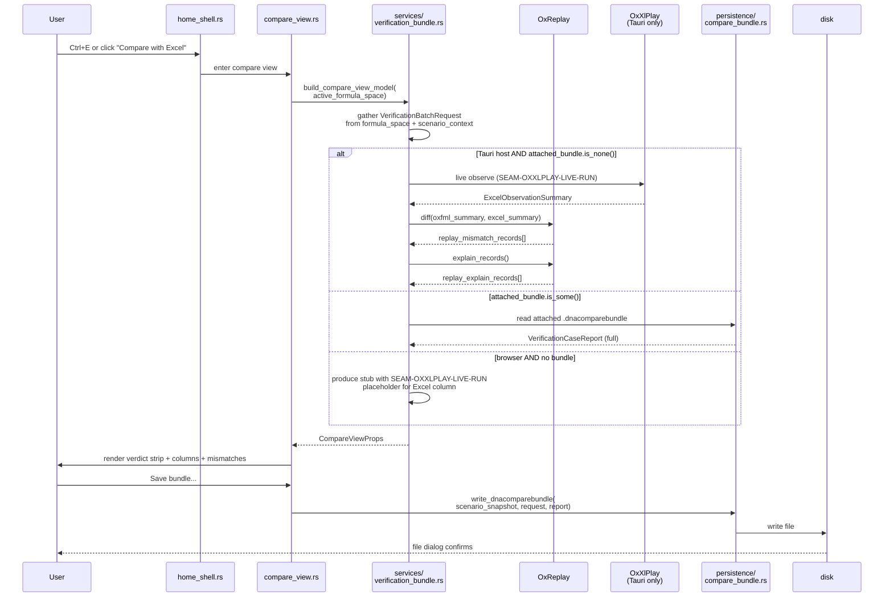
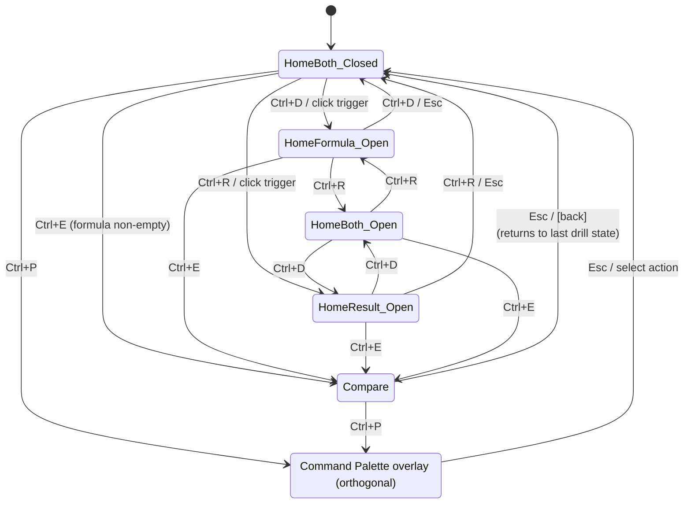

# APP_UX_REALIZATION — WS-14 Progressive-Disclosure Home

> **Document role.** Detailed realization spec mapping every surface of the
> [WS-14 mockup](ux_artifacts/ws14_progressive_home_mockup.html) onto OneCalc's
> internal layers and the upstream library types in `OxFml`, `OxFunc`,
> `OxReplay`, `OxXlPlay`. Used to validate that the new UX maps cleanly onto
> library concepts before implementation, and to flag gaps in both directions.
>
> **Companion docs.**
> - [APP_UX_BRIEF.md](APP_UX_BRIEF.md) — UX direction and vocabulary
> - [APP_UX_ARCHITECTURE.md](APP_UX_ARCHITECTURE.md) — region ownership rules
> - [HOST_VIEW_MODEL_REFERENCE.md](HOST_VIEW_MODEL_REFERENCE.md) — view-model anchor
> - [APP_UX_PANEL_INVENTORY.md](APP_UX_PANEL_INVENTORY.md) — panel taxonomy
> - WS-14 plan in `~/.claude/plans/revisit-our-ux-guidelines-swift-sphinx.md`
>
> **Status.** `realization_v1` · 2026-04-26 · supersedes the three-mode reading
> in `APP_UX_SCREEN_SPEC_*.md` once WS-14 lands.

---

## 0. Reading guide

| Section | What you get | When to read |
|---|---|---|
| [§1](#1-vocabulary-anchor) | Vocabulary anchor | Always |
| [§2](#2-layer-architecture) | Layer architecture diagram | First pass |
| [§2A](#2a-the-formatting-model--oxfml-is-authoritative) | **Formatting model — OxFml is authoritative** | Before result-drill work |
| [§3](#3-surface-master-map) | **Master surface map** | Spec table |
| [§4](#4-per-surface-realization) | Per-surface deep dive | When implementing one surface |
| [§5](#5-persistence-shapes) | `.dnascenario` and `.dnacomparebundle` shapes | Persistence work |
| [§6](#6-library-mapping-table) | **Library mapping table** | Library audit |
| [§7](#7-gap-analysis) | **Gaps and seams** (critical) | Seam authoring |
| [§8](#8-data-flow-diagrams) | Three end-to-end flows | Flow validation |
| [§9](#9-ui-state-machine) | UI state machine | Test scaffolding |
| [§10](#10-component-and-file-inventory) | New file inventory with prop contracts | Implementation |
| [§11](#11-open-questions) | Open questions | Roadmap input |

---

## 1. Vocabulary anchor

These terms are taken verbatim from the existing brief, charter, and library
type names. **Preserve them everywhere** — code, doc strings, UI copy, test
identifiers.

| Term | Meaning | Origin |
|---|---|---|
| `formula_space` | One unit of work — entered text + context + result + retained verdicts | `state/types.rs::FormulaSpaceState` |
| `scenario` | UX-facing label for a saved formula_space (one and the same; persistence shape). Always named or anonymous-`untitled-N` | UX brief |
| `green-tree key` | Content-addressed parse tree identity, format `green:{fingerprint:016x}` | `OxFml/.../syntax/green.rs:90` |
| `effective_display_text` | **OxFml-authoritative** final display string after host format + CF — output of the publication pipeline | `OxFml/.../publication/mod.rs:65` (field of `VerificationPublicationSurface`) |
| `VerificationPublicationContext` | **Host-provided** comprehensive Excel-like format input to OxFml: `format_profile`, `number_format_code`, `style_id`, `style_hierarchy`, `font_color`, `fill_color`, `cf_rules` | `OxFml/.../publication/mod.rs:30` |
| `VerificationPublicationSurface` | **OxFml-produced** authoritative formatted output; the canonical "what should be displayed and in what colors" | `OxFml/.../publication/mod.rs:65` |
| `LocaleFormatContext` | Locale-and-date-system context (separate input to OxFml's publication call) carrying `FormatProfile` and `WorkbookDateSystem` | `OxFunc/oxfunc_core/src/locale_format.rs` |
| `CalcValue` | Native OxFunc value carried through OneCalc without a local value mirror | `OxFunc/oxfunc_value_types/src/lib.rs` |
| `CoreValue` | Core scalar / array / error payload inside `CalcValue` | `OxFunc/oxfunc_value_types/src/lib.rs` |
| `PresentationHint` | **Axis-narrow OxFunc hint** carried through native `CalcValue` / returned-value surfaces. *Not authoritative.* Used by OxFml as a **fallback** when the host context omits a `number_format_code`. | `OxFunc/oxfunc_value_types/src/lib.rs` |
| `NumberFormatHint` | The number-format axis of `PresentationHint` (`General/DateLike/Percentage/Currency/Scientific/Fraction/Custom`) | `OxFunc/oxfunc_value_types/src/lib.rs` |
| `LocaleProfileId` | Locale identifier; today `EnUs` and `CurrentExcelHost` only | `OxFunc/oxfunc_core/src/locale_format.rs:6` |
| `WorksheetErrorCode` | Excel error codes (`#DIV/0!`, `#NAME?`, …) | `OxFunc/oxfunc_value_types/src/lib.rs:15` |
| `LiveDiagnostic` | Authoring-time diagnostic with severity + stage | `OxFml/.../consumer/editor/types.rs:50` |
| `FormulaDrillNodeViewModel` | Per-node parse/bind/eval projection (host-side mirror of `SemanticPlan` walk) | `adapters/oxfml/types.rs` |
| `FormulaEditReuseSummary` | Tells UI which subtrees were reused on the last edit | `OxFml/.../consumer/editor/types.rs:92` |
| `VerificationCaseReport` | One case's full verdict envelope (value/display/replay) | `services/verification_bundle.rs:123` |
| `OxReplayMismatchRecord` | Single mismatch between two replay scenarios | `services/verification_bundle.rs:101` |
| `OxReplayExplainRecord` | Explanation row for a mismatch | `services/verification_bundle.rs:111` |
| `view_family` | String tag identifying which comparison axis diverged (`effective_display_text`, `worksheet_comparison_value`, …) | `OxReplay/.../oxreplay-diff/src/lib.rs:29` |
| `MismatchKind` | Category of mismatch (`EffectiveDisplayText`, `ConditionalFormattingView`, …) | `OxReplay/.../oxreplay-diff/src/lib.rs:12` |
| `SeverityClass` | Severity (`Semantic`, `Instrumentation`, `Informational`, `Coverage`) | `OxReplay/.../oxreplay-abstractions/src/lib.rs:56` |
| `ProjectionTruthSource` | Whether a projection is live-backed or local-fallback | `state/types.rs` |
| `ProgrammaticHostProfile` | Host identity for a verification batch | `services/programmatic_testing.rs` |
| `blocked` / `opaque` | Honesty markers when something can't be shown live | UX brief; reducer derives |
| `handoff` | Exporting a scenario/comparison as upstream work request | UX brief |
| `evidence bundle` | Durable carrier of scenario + verdicts (= `.dnacomparebundle` in WS-14) | UX brief |

---

## 2. Layer architecture



**Reading rules.**

- The component layer is **stateless w.r.t. business state**; everything it
  renders comes through a view-model. Local UI state (drill-down open/closed,
  command palette open) lives in `RwSignal`s scoped to the component.
- The view-model is **pure** — `build_*_view_model(state)` is a function, not
  a struct method.
- Intents flow **down** (component → reducer); state flows **up** through
  view-model recomputation.
- The bridge is the **only** hot path to upstream `OxFml`/`OxFunc`. `OxReplay`
  and `OxXlPlay` are reached through the verification-bundle service or future
  compare-view services, not directly from the editor.

---

## 2A. The formatting model — OxFml is authoritative

> **Read this before §3.5 (result drill surface) and §4.4 (result drill view-model).**
>
> The mockup's first cascade implied a single linear pipeline through
> "presentation hint → format code → locale → CF → effective display".
> That reading is wrong. The actual model has **two distinct sources of
> formatting input** and **OxFml is the only authority that composes them.**

### 2A.1 The two-stage publication pipeline



### 2A.2 What the diagram is telling you

1. **Two inputs, not one.** `PresentationHint` (from OxFunc, axis-narrow) and
   `VerificationPublicationContext` (from the host, comprehensive) are
   **separate** sources. The hint is *not* a "step" between value and format
   code; it's a **fallback** that OxFml consults *only* when the host context
   doesn't specify a `number_format_code`.
2. **Precedence rule.** Host `number_format_code` wins. If `render_with_code`
   succeeds against `LocaleFormatContext`, the hint never enters. If the host
   omits the code (or `render_with_code` fails), OxFml falls back to the hint:
   `Currency → render_currency`, `DateLike → "yyyy-mm-dd"`, `Percentage →
   "0%"`, others → plain `render_visible_number`. (`OxFml/.../publication/mod.rs:526–568`).
3. **CF rules are evaluated by OxFml, not the host.** The host *supplies*
   `Vec<VerificationConditionalFormattingRule>` in the publication context;
   OxFml's `evaluate_conditional_formatting_rule` decides `applies`,
   `effective_display_text`, `effective_font_color`, `effective_fill_color`
   per rule (`OxFml/.../publication/mod.rs:702–755`). When multiple CF rules
   apply, **last-wins** (`.iter().rev().find(|r| r.applies == Some(true))`).
4. **`base_effective_display_text` is internal.** It exists as a local in
   `build_verification_publication_surface` (`mod.rs:116`). It is **not** a
   field on the surface and not a named type. The result drill cascade still
   shows it as an intermediate step for *user explanation*, but the project
   does not need an in-state struct for it.
5. **OxFml retains inputs on the surface for auditability.** The
   `VerificationPublicationSurface` carries back `presentation_hint`,
   `number_format_code`, `locale_format_context`, plus per-rule `applies` and
   `effective_*`. Everything the cascade needs to render is *already on the
   surface*; the result drill view-model is mostly projection, not derivation.

### 2A.3 What this means for the UX

- The result drill cascade should display **two parallel input columns and
  one output column**, not a single linear pipeline.
- The OxFunc presentation hint deserves its own small "from the function"
  sidecar — it is conceptually different from host-supplied format and the
  user benefits from seeing that a function *also* opined on display.
- The host context controls (number format code editor, locale dropdown,
  CF rule list) all populate `VerificationPublicationContext` for the next
  evaluation. They are not "intermediate steps" — they are inputs.
- The "effective" values (display, font, fill) are always the OxFml-computed
  truth. The cascade's last row is `effective_display_text`, terminating the
  pipeline; rendering anywhere else (result hero, compare view) reads from
  the same field.
- **Do not invent a unified "format family taxonomy."** OxFunc's
  `NumberFormatHint` is a hint; it is **not** the canonical taxonomy. The
  authoritative format identity is the **format code string** that OxFml
  composes against `LocaleFormatContext`. The result drill's number-format
  control is therefore a **format code editor with optional preset
  shortcuts**, not a family selector.

### 2A.4 Vocabulary lock

| OxFml-preferred name | What it is | Where it appears in the UX |
|---|---|---|
| `VerificationPublicationContext` | Host-provided comprehensive format input (the controls write to this) | Result drill scenario-context section |
| `VerificationPublicationSurface` | OxFml-produced authoritative result (everything the UI reads for display) | Result hero + result drill cascade + compare view |
| `presentation_hint` (`PresentationHint`) | OxFunc's axis-narrow hint travelling with native `CalcValue` / returned-value surfaces | Result drill — separate "from OxFunc" sidecar |
| `LocaleFormatContext` | Locale + date-system input (separate from publication context) | Result drill scenario-context locale + date-basis rows |
| `base_effective_display_text` | Local intermediate (format applied, no CF). Not a named type. | Result drill cascade — single row labelled "format applied (pre-CF)" |
| `effective_display_text` | Final post-CF display string | Result drill cascade — final row; result hero value; compare view display row |
| `effective_font_color` / `effective_fill_color` | Final post-CF colors | Result drill cascade — color-swatch row |
| `applies` (per-rule) | Whether a single CF rule's condition evaluated true | Result drill — each CF rule's row |
| **last-wins** | CF compositing rule when multiple rules apply | Result drill — annotated under the CF rule list |

---

## 3. Surface master map

Every named region in the [mockup](ux_artifacts/ws14_progressive_home_mockup.html)
mapped to the layer chain that produces it. The columns:

- **mockup region** — region id from the mockup HTML / WS-14 plan §1.2
- **component** — file under `src/dnaonecalc-host/src/ui/components/`
- **view-model field** — field on the view-model the component consumes
- **service builder** — function in `src/dnaonecalc-host/src/services/`
- **state slice** — slice of `OneCalcHostState` it derives from
- **upstream type** — type from `OxFml`/`OxFunc`/`OxReplay`/`OxXlPlay`
- **status** — `live` / `seam:<id>`

### 3.1 Titlebar

| Mockup region | Component | View-model field | Service builder | State slice | Upstream type | Status |
|---|---|---|---|---|---|---|
| brand mark | `home_shell.rs` | static | — | — | — | live |
| `[unsaved/name] ▾` breadcrumb | `scenario_breadcrumb.rs` | `ScenarioBreadcrumbView { display_label, dirty, recents, pinned }` | `scenario_service::build_breadcrumb_view` | `workspace_shell.recent_*`, `workspace_shell.pinned_*`, active scenario | `FormulaSpaceState.context.scenario_label` (existing) | live |
| breadcrumb dropdown items | `scenario_breadcrumb.rs` | `ScenarioRecordView[]` | `scenario_service::list_scenarios` | `workspace_shell.recent_formula_spaces`, `workspace.pinned_formula_space_ids` | — | live, persistence stubbed `seam:SCENARIO-PERSIST` |
| `⌃P` palette hint | `home_shell.rs` | static | — | — | — | live |
| `[Compare with Excel]` button | `home_shell.rs` | `disabled = formula_text.is_empty()` | `home_shell_view_model` | `formula_spaces[active].raw_entered_cell_text` | — | live |

### 3.2 Editor section

| Mockup region | Component | View-model field | Service builder | State slice | Upstream type | Status |
|---|---|---|---|---|---|---|
| `formula ▸` caption | `editor_hero.rs` | static | — | — | — | live |
| entry-mode pill | `editor_hero.rs` | `EditorEntryMode` | `editor_session` (derived) | `formula_spaces[id].raw_entered_cell_text` (first char) | — | live |
| line-number gutter | `editor_hero.rs` | derived from text line count | local | `raw_entered_cell_text` | — | live |
| textarea text | `editor_hero.rs` | `raw_entered_cell_text` | `build_explore_view_model` (preserved) | `formula_spaces[id]` | — | live |
| caret / selection | `editor_hero.rs` | `editor_surface_state.caret`, `.selection` | preserved | `EditorSurfaceState` (`ui/editor/state.rs`) | — | live |
| syntax overlay | `editor_hero.rs` | `syntax_runs: Vec<SyntaxRun>` | `syntax_runs_from_snapshot` (`ui/editor/render_projection.rs`) | bridge `EditorSyntaxSnapshot.tokens` | `OxFml` `EditorToken`+`SyntaxKind` | live |
| diagnostic squiggle | `editor_hero.rs` | `diagnostics: Vec<ExploreDiagnosticView>` | preserved | bridge `LiveDiagnosticSnapshot` | `OxFml` `LiveDiagnostic` | live |
| diagnostic hover tooltip | `editor_hero.rs` | `diagnostic.message` | — | same | `OxFml` `LiveDiagnostic` | live |
| bracket-pair highlight | `editor_hero.rs` | `bracket_pair: Option<BracketPairHighlight>` | `bracket_matcher::bracket_pair_for_caret` | local | — | live |
| completion popup | `editor_hero.rs` | `completion_items`, `completion_anchor_offset`, `selected_completion_proposal_id` | preserved | bridge `completion_proposals` | `OxFml` `CompletionProposal` | live |
| signature help | `editor_hero.rs` | `signature_help: Option<ExploreSignatureHelpView>` | preserved | bridge `signature_help` | `OxFml` `SignatureHelpContext` | live |
| identifier hover help | `editor_hero.rs` | `function_help: Option<ExploreFunctionHelpView>` | preserved | bridge `function_help` | `OxFml` `FunctionHelpPacket` | live |
| editor-foot drill toggle | `editor_hero.rs` | local UI signal | — | — | — | live |
| editor-foot metrics chip | `editor_hero.rs` | `editor_metrics: { tokens, functions, refs, status }` | new in `home_shell_view_model` | `EditorSyntaxSnapshot.tokens` (counted) + `bind_summary` | `OxFml` `BindSummary` (refs + names) | live + count derivation new |

### 3.3 Formula drill-down

| Mockup region | Component | View-model field | Service builder | State slice | Upstream type | Status |
|---|---|---|---|---|---|---|
| panel container | `formula_drill.rs` | local UI signal `data-expanded` | — | — | — | live |
| walk-tree rows | `formula_drill.rs` | `walk_nodes: Vec<FormulaDrillNodeView>` | `formula_drill_view_model::build` | bridge `formula_walk: Vec<FormulaDrillNodeViewModel>` | host `FormulaDrillNodeViewModel` (mirrors OxFml `SemanticPlan` slice) | live |
| state chip (`evaluated`/`bound`/`opaque`/`blocked`) | `formula_drill.rs` | `node.state: FormulaDrillNodeState` | preserved | bridge | host `FormulaDrillNodeState` | live |
| `value_preview` right-aligned | `formula_drill.rs` | `node.value_preview: Option<String>` | preserved | bridge | bridge | live |
| hover → editor span highlight | `formula_drill.rs` ⇄ `editor_hero.rs` | shared signal `hovered_node_span: Option<TextSpan>` | local | — | `OxFml` `TextSpan` (via node attribution) | needs node→span map; `seam:WALK-NODE-SPAN-ATTRIB` if not yet on node |
| parse / bind / eval phase strip | `formula_drill.rs` | `parse_summary`, `bind_summary`, `eval_summary` | preserved | bridge | `OxFml` `ParseSummary`, `BindSummary`, `EvalSummary` | live |
| right-click "Evaluate subtree with…" | `formula_drill.rs` | static menu | — | — | — | `seam:OXFML-PARTIAL-EVAL` |

### 3.4 Result section

| Mockup region | Component | View-model field | Service builder | State slice | Upstream type | Status |
|---|---|---|---|---|---|---|
| `result ▸` caption | `result_hero.rs` | static | — | — | — | live |
| result-class pill (Number/Array/Error/…) | `result_hero.rs` | `result_class: ResultClass` enum | `result_view_model::classify` | native `CalcValue` discriminator | `OxFunc` `CalcValue`, `CoreValue` | live |
| 72 pt result value | `result_hero.rs` | `result_render: ResultHeroRender` (per-variant) | `result_view_model::render` | native `CalcValue` plus OxFml publication surface | `OxFunc` `CalcValue` | live |
| array preview grid | `result_hero.rs` | `array_preview: Option<FormulaArrayPreview>` | preserved | bridge `array_preview` | `OxFunc` `EvalArray` | live |
| error glyph rendering | `result_hero.rs` | `error_render: Option<ErrorRender>` | new in result_view_model | bridge | `OxFunc` `WorksheetErrorCode`, `ErrorSurface` | live |
| result-foot drill toggle | `result_hero.rs` | local UI signal | — | — | — | live |
| result-foot context chip (`de-DE · CURRENCY · deterministic`) | `result_hero.rs` | `context_chip: ContextChipView` | `home_shell_view_model::build_context_chip` | `formula_spaces[id].context` + scenario locale/format | derived | live (today shows `host_profile`/`packet_kind`/`capability_floor`); locale/format/policy `seam` until WS-14 lands scenario-context state extension |

### 3.5 Result drill-down

> **Read [§2A](#2a-the-formatting-model--oxfml-is-authoritative) first.**
> The cascade is a *projection of OxFml's authoritative
> `VerificationPublicationSurface`*, plus a sidecar showing what the OxFunc
> function (if any) hinted. The scenario-context block under it is the **set
> of editable controls that populate `VerificationPublicationContext` for the
> next evaluation**. Inputs and outputs are visually distinct.

#### 3.5a Cascade — authoritative output projection

| Mockup region | Component | View-model field | Service builder | State slice | Upstream type | Status |
|---|---|---|---|---|---|---|
| cascade row `source value` | `result_drill.rs` | `cascade.source_value: SourceValueRow` | `result_drill_view_model::build` | native `CalcValue` / `CoreValue` payload | `OxFunc` `CalcValue` | live |
| sidecar `from OxFunc` (small block) | `result_drill.rs` | `cascade.oxfunc_hint: Option<PresentationHintView>` | same | native presentation hint carried through `CalcValue` / returned-value surface | `OxFunc` `PresentationHint` (`NumberFormatHint`, `CellStyleHint`) | live; **separated visually** from the host-context input — it's a hint, not a step |
| cascade row `host format inputs` (group) | `result_drill.rs` | `cascade.host_inputs: HostFormatInputsRow` | same | active `VerificationPublicationContext` (new state field) | `OxFml` `VerificationPublicationContext` | live |
| → sub-row `number_format_code` | `result_drill.rs` | `cascade.host_inputs.number_format_code: Option<String>` (editable) | same | same | `OxFml::publication.number_format_code` | live (string); picker `seam:OXFUNC-FORMAT-CODE-PICKER` |
| → sub-row `style_id` / `style_hierarchy` | `result_drill.rs` | `cascade.host_inputs.style_id`, `style_hierarchy` | same | same | `OxFml::publication.style_id`, `style_hierarchy` | live (read-only display today); editing `seam:ONECALC-STYLE-AUTHORING` |
| → sub-row `base font_color` | `result_drill.rs` | `cascade.host_inputs.font_color: Option<String>` | same | same | `OxFml::publication.font_color` | live |
| → sub-row `base fill_color` | `result_drill.rs` | `cascade.host_inputs.fill_color: Option<String>` | same | same | `OxFml::publication.fill_color` | live |
| cascade row `locale + date system` | `result_drill.rs` | `cascade.locale_inputs: LocaleInputsRow` | same | `LocaleFormatContext` (new state-derived) | `OxFunc` `LocaleProfileId` + `WorkbookDateSystem` | live for `EnUs`/`CurrentExcelHost`; broader locale `seam:OXFUNC-LOCALE-EXPAND` |
| cascade step row `Step 1: format applied (pre-CF)` | `result_drill.rs` | `cascade.base_effective_display: String` | same | bridge `VerificationPublicationSurface` exposed via `value_presentation` (or directly when surface is bridged through) | `OxFml` local `base_effective_display_text` (intermediate; see [§2A.2](#2a2-what-the-diagram-is-telling-you)) | live; **needs bridge mirror exposing this** — `seam:BRIDGE-PUBLICATION-SURFACE` |
| cascade row `CF rules evaluation` (per rule) | `result_drill.rs` | `cascade.cf_rules: Vec<CfRuleEvaluationRow>` (each: rule + `applies` + `effective_display` + `effective_colors`) | same | `VerificationPublicationSurface.conditional_formatting_*` | `OxFml` `VerificationConditionalFormattingRule` (post-eval, including `applies` and `effective_*`) | live |
| cascade step row `Step 2: last-wins compositing` | `result_drill.rs` | `cascade.last_wins_indicator: Option<usize>` (which rule won) | same | derived from rules iteration | `OxFml` last-wins logic | live |
| cascade final row `effective_display_text` | `result_drill.rs` | `cascade.effective_display: String` | same | `VerificationPublicationSurface.effective_display_text` | `OxFml` authoritative output | live |
| cascade final row `effective colors` | `result_drill.rs` | `cascade.effective_colors: { font: Option<String>, fill: Option<String> }` | same | `VerificationPublicationSurface.effective_font_color`, `effective_fill_color` | `OxFml` authoritative output | live |

#### 3.5b Scenario context — editable controls populating `VerificationPublicationContext`

| Mockup region | Component | View-model field | Service builder | State slice | Upstream type | Status |
|---|---|---|---|---|---|---|
| host profile dropdown | `result_drill.rs` | `ctx.host_profile: ProgrammaticHostProfileView` | `home_shell_view_model::scenario_context` | new field on `FormulaSpaceContextState` | `services::programmatic_testing::ProgrammaticHostProfile` | live (sparse); richer catalog `seam:ONECALC-HOST-PROFILE-CATALOG` |
| number-format-code editor + presets | `result_drill.rs` | `ctx.number_format_code: Option<String>` | same | new field; written into next-eval's `VerificationPublicationContext.number_format_code` | string; presets are host-curated | live (raw string); preset picker `seam:OXFUNC-FORMAT-CODE-PICKER` |
| locale dropdown | `result_drill.rs` | `ctx.locale: LocaleProfileId` | same | new field; populates next-eval's `LocaleFormatContext.profile.id` | `OxFunc` `LocaleProfileId` | live for two; rest `seam:OXFUNC-LOCALE-EXPAND` |
| date basis radio (1900/1904) | `result_drill.rs` | `ctx.date1904: bool` | same | new field; populates `LocaleFormatContext.date_system: WorkbookDateSystem` | `OxFunc` `WorkbookDateSystem` | live |
| base font color picker (advanced) | `result_drill.rs` | `ctx.base_font_color: Option<String>` | same | new field; populates `VerificationPublicationContext.font_color` | host-string | live (advanced section, hidden by default) |
| base fill color picker (advanced) | `result_drill.rs` | `ctx.base_fill_color: Option<String>` | same | new field; populates `VerificationPublicationContext.fill_color` | host-string | live (advanced section) |
| CF rule list + add buttons | `result_drill.rs` | `ctx.cf_rules: Vec<CfRuleAuthoringView>` + `+ rule` family buttons | same | new field; serializes to `Vec<VerificationConditionalFormattingRule>` for next-eval | `OxFml` `VerificationConditionalFormattingRule` (authoring direction) | observation-type round-trip `live`; **authoring API** `seam:ONECALC-CF-RULE-AUTHORING` per family |
| scenario policy radio (deterministic / live-recalc) | `result_drill.rs` | `ctx.scenario_policy: ScenarioPolicy` | same | new field on `FormulaSpaceContextState`; OneCalc-owned | new on OneCalc side (host policy per CHARTER §4) | live |
| `Save as scenario…` button | `result_drill.rs` | callback `on_save_as` | → `scenario_service::save_as` | persists snapshot of `FormulaSpaceState` | — | live; disk `seam:ONECALC-SCENARIO-PERSIST` |
| `Reset context to defaults` button | `result_drill.rs` | callback `on_reset_context` | scenario_service | clears scenario context fields | — | live |

### 3.6 Status foot

| Mockup region | Component | View-model field | Service builder | State slice | Upstream type | Status |
|---|---|---|---|---|---|---|
| live-bridge dot | `status_foot.rs` | `bridge_health: BridgeHealth` | `home_shell_view_model::status_foot` | `OxfmlHostSessionError` last-call | bridge | live |
| `green-tree key` | `status_foot.rs` | `green_tree_key: Option<String>` | preserved | bridge `editor_syntax_snapshot.green_tree_key` | `OxFml` `GreenTreeRoot.green_tree_key` | live |
| scenario name | `status_foot.rs` | `scenario_label: String` | preserved | `formula_spaces[id].context.scenario_label` | — | live |
| `saved 14:22` timestamp | `status_foot.rs` | `last_saved_at: Option<DateTime>` | scenario_service | new field on FormulaSpaceState | — | live; disk `seam:ONECALC-SCENARIO-PERSIST` |
| auto-proof timing | `status_foot.rs` | `auto_proof_quiet_interval_ms` | preserved | `editor_settings.auto_proof_quiet_interval_ms` | — | live |
| **truth-source chip** (missing in mockup; should add) | `status_foot.rs` | `ProjectionTruthSource` | preserved | `formula_spaces[id].context.truth_source` | — | live; **see [§7.2](#72-library-concepts-not-surfaced-in-the-mockup)** |

### 3.7 Compare view

| Mockup region | Component | View-model field | Service builder | State slice | Upstream type | Status |
|---|---|---|---|---|---|---|
| back button | `compare_view.rs` | callback | — | — | — | live |
| compare title (scenario name) | `compare_view.rs` | `scenario_label` | preserved | `formula_spaces[id].context.scenario_label` | — | live |
| save-bundle button | `compare_view.rs` | callback | — | — | — | live |
| save-bundle dropdown items | `compare_view.rs` | `BundleAction[]` | new | — | — | live (Save), `seam:COMPARE-EMAIL-HANDOFF`, `seam:COMPARE-UPLOAD` |
| verdict pill `value ✓` | `compare_view.rs` | `verdicts.value_match: Verdict` | `compare_view_model::build` | `RetainedArtifactRecord.value_match` | `services::verification_bundle::VerificationCaseReport.value_match` | live |
| verdict pill `display ✕` | `compare_view.rs` | `verdicts.display_match: Verdict` | same | `display_match` | same | live |
| verdict pill `replay ✓` | `compare_view.rs` | `verdicts.replay_equivalent: Verdict` | same | `replay_equivalent` | same | live |
| two-column DnaCalc rows | `compare_view.rs` | `dnacalc_column: CompareColumnView` | same | bridge `value_presentation` + bridge `formula_walk` summary | `OxFml`/`OxFunc` | live |
| two-column Excel rows | `compare_view.rs` | `excel_column: CompareColumnView` | same | `RetainedArtifactRecord.excel_*` and `excel_summary: ExcelObservationSummary` | `OxXlPlay` `ExcelObservationSummary` | live (when bundle imported); **live-run** `seam:OXXLPLAY-LIVE-RUN` |
| `◀ mismatch` row marker | `compare_view.rs` | `row.is_mismatch: bool` | same | derived | — | live |
| mismatch list groups | `compare_mismatch_list.rs` | `groups: Vec<MismatchGroupView>` (by `view_family`) | same | `RetainedArtifactRecord.replay_mismatch_records` | `OxReplay` `OxReplayMismatchRecord` | live |
| mismatch detail rows (left/right repr, detail) | `compare_mismatch_list.rs` | `record: MismatchRecordView` | same | `OxReplayMismatchRecord` | same | live |
| `→ explain` line | `compare_mismatch_list.rs` | `explain: Option<ExplainRecordView>` | same | `RetainedArtifactRecord.replay_explain_records` joined by `query_id` | `OxReplay` `OxReplayExplainRecord` | live |

### 3.8 Command palette + workspace settings

| Mockup region | Component | View-model field | Service builder | State slice | Upstream type | Status |
|---|---|---|---|---|---|---|
| palette overlay | `command_palette.rs` | `is_open: RwSignal<bool>` | — | — | — | live |
| palette input + filter | `command_palette.rs` | `query: RwSignal<String>` | — | — | — | live |
| palette action rows | `command_palette.rs` | `actions: Vec<PaletteActionView>` | `command_palette_view_model::build` | static + scenario list | — | live |
| palette scenario rows | `command_palette.rs` | `scenarios: Vec<ScenarioRecordView>` | same | `workspace_shell.recent_formula_spaces` | — | live |
| palette function rows | `command_palette.rs` | `functions: Vec<FunctionPaletteView>` | same | catalog (small, derived from `EditorDocument` over time, or `seam:ONECALC-FUNCTION-CATALOG`) | `OxFml` `FunctionHelpPacket` | live for visited functions; full catalog `seam:ONECALC-FUNCTION-CATALOG` |
| `Ctrl+,` workspace settings | `workspace_settings.rs` | `settings: WorkspaceSettingsView` | new | `global_ui_chrome.editor_settings` + capability state | — | live |
| seam status board | `seam_status_board.rs` | `seams: Vec<SeamRowView>` | new | static seam registry | — | live (table is hand-authored; `seam:SEAM-REGISTRY-AUTOGEN` later) |

---

## 4. Per-surface realization

Per surface: shape of the view-model, the exact projection rule, callbacks
emitted upward, and any new state fields required.

### 4.1 Editor hero — `editor_hero.rs`

**View-model contract (subset of preserved `ExploreViewModel`):**

```rust
pub struct EditorHeroProps {
    pub raw_entered_cell_text: String,
    pub editor_surface_state: EditorSurfaceState,
    pub overlay_geometry: Option<EditorOverlayGeometrySnapshot>,
    pub syntax_runs: Vec<SyntaxRun>,
    pub diagnostics: Vec<ExploreDiagnosticView>,
    pub completion_items: Vec<ExploreCompletionItemView>,
    pub selected_completion_proposal_id: Option<String>,
    pub completion_anchor_offset: Option<usize>,
    pub signature_help: Option<ExploreSignatureHelpView>,
    pub function_help: Option<ExploreFunctionHelpView>,
    pub bracket_pair: Option<BracketPairHighlight>,
    pub entry_mode: EditorEntryMode,
    pub live_state: EditorLiveState,
    pub editor_metrics: EditorMetricsView,            // new
    pub formula_drill_open: bool,                     // local UI signal
    pub on_input_event: Callback<EditorInputEvent>,
    pub on_command: Callback<EditorCommand>,
    pub on_overlay_measurement: Callback<EditorOverlayMeasurementEvent>,
    pub on_toggle_formula_drill: Callback<()>,
}

pub struct EditorMetricsView {
    pub token_count: usize,
    pub function_count: usize,
    pub reference_count: usize,
    pub status: ParseStatus,        // Clean | HasDiagnostics(usize) | Empty
}
```

**Projection rules.**

- `editor_metrics.token_count` ← `EditorSyntaxSnapshot.tokens.len()`
- `editor_metrics.function_count` ← count of tokens with classification `SyntaxTokenRole::Function` (already in `SyntaxRun`)
- `editor_metrics.reference_count` ← `BindSummary.reference_count`
- `editor_metrics.status` ← `if diagnostics.is_empty() { Clean } else { HasDiagnostics(n) }`

**Keyboard contract.** Editor steals only what native textarea cannot do
(see WS-14 plan §2.2). Native scrolling, selection, undo/redo, IME, clipboard
remain the textarea's. The `keydown_to_command` table in
[`commands.rs`](../src/dnaonecalc-host/src/ui/editor/commands.rs)
is the source of truth; the only WS-14 changes are:

- `Ctrl+Enter` rebinds from `RequestProof` to `CommitEntry`
- `Ctrl+Alt+I` (`SendSelectionToInspect`) is removed (no Inspect mode)
- `Ctrl+D` adds: `ToggleFormulaDrill` (new variant)
- `Ctrl+R` adds: `ToggleResultDrill` (new variant)
- `Ctrl+E` adds: `EnterCompare` (new variant)

### 4.2 Formula drill-down — `formula_drill.rs`

**View-model contract:**

```rust
pub struct FormulaDrillProps {
    pub is_open: RwSignal<bool>,
    pub walk_nodes: Vec<FormulaDrillNodeView>,        // recursive
    pub parse_summary: Option<ParseSummary>,
    pub bind_summary: Option<BindSummary>,
    pub eval_summary: Option<EvalSummary>,
    pub hovered_node_id: RwSignal<Option<String>>,
    pub on_node_hover: Callback<Option<String>>,
    pub on_node_click: Callback<NodeClickIntent>,     // selects span in editor
}

pub struct FormulaDrillNodeView {
    pub node_id: String,
    pub label: String,                                // e.g. "FILTER(sales, region = \"EU\")"
    pub state: FormulaDrillNodeState,                  // preserved enum
    pub value_preview: Option<String>,
    pub depth: usize,
    pub children: Vec<FormulaDrillNodeView>,
    pub source_span: Option<TextSpan>,                // for editor cross-highlight
}

pub enum NodeClickIntent {
    SelectSpan(TextSpan),
    CopyExpression(String),
    CopyValue(String),
}
```

**Projection rule.**

```
service: formula_drill_view_model::build(
    formula_walk: &[FormulaDrillNodeViewModel],
    source_text: &str,
) -> Vec<FormulaDrillNodeView>
```

Recursively projects each `FormulaDrillNodeViewModel` into a flat-or-nested view; the
`source_span` field is computed by calling `attribute_node_to_span(label,
source_text)` (host-side string match for now;
`seam:WALK-NODE-SPAN-ATTRIB` for engine-provided attribution).

**Cross-highlight contract.** The drill panel writes
`hovered_node_id` on hover; `editor_hero.rs` reads it, looks up the matching
`source_span` from the drill view-model, and renders an overlay box on top of
the textarea via the existing `EditorOverlayBox` machinery
(`ui/editor/geometry.rs`).

### 4.3 Result drill-down — `result_drill.rs`

> **Read [§2A](#2a-the-formatting-model--oxfml-is-authoritative) first.** The
> view-model below distinguishes (1) the OxFml-authoritative cascade output,
> (2) the OxFunc hint sidecar (different concept), and (3) the editable
> controls that populate `VerificationPublicationContext` for the next eval.

**View-model contract:**

```rust
pub struct ResultDrillProps {
    pub is_open: RwSignal<bool>,
    pub cascade: ResultCascadeView,                   // projection of OxFml VerificationPublicationSurface
    pub oxfunc_hint_sidecar: Option<OxFuncHintSidecar>, // separate from cascade — OxFunc's narrow hint
    pub scenario_context: ScenarioContextView,        // editable inputs to next-eval VerificationPublicationContext
    pub on_number_format_code_edit: Callback<String>,
    pub on_locale_change: Callback<LocaleProfileId>,
    pub on_date_basis_change: Callback<bool>,         // 1904 = true
    pub on_base_font_color_change: Callback<Option<String>>,
    pub on_base_fill_color_change: Callback<Option<String>>,
    pub on_cf_rule_add: Callback<CfRuleFamily>,       // family-keyed; each `seam:OXFUNC-CF-*`
    pub on_cf_rule_edit: Callback<(CfRuleId, CfRuleAuthoringEdit)>,
    pub on_cf_rule_remove: Callback<CfRuleId>,
    pub on_scenario_policy_change: Callback<ScenarioPolicy>,
    pub on_save_as_scenario: Callback<()>,
    pub on_reset_context: Callback<()>,
}

/// Cascade is a *projection of OxFml's `VerificationPublicationSurface`* — read-only.
/// The pipeline is two stages: (1) format applied → `base_effective_display`,
/// (2) per-CF evaluation → final `effective_*`. Last-wins compositing.
pub struct ResultCascadeView {
    // -- inputs to the pipeline (read-only display of what the host sent) --
    pub source_value: SourceValueRow,                 // CalcValue / CoreValue discriminator + repr
    pub host_inputs: HostFormatInputsRow,             // VerificationPublicationContext fields
    pub locale_inputs: LocaleInputsRow,               // LocaleFormatContext fields

    // -- step 1: format applied, no CF --
    pub base_effective_display: String,               // OxFml local intermediate

    // -- step 2: each CF rule evaluated --
    pub cf_rule_evaluations: Vec<CfRuleEvaluationRow>, // post-eval, with `applies` + `effective_*`
    pub last_wins_index: Option<usize>,               // which rule produced the final effective values

    // -- final OxFml-authoritative outputs --
    pub effective_display: String,                    // VerificationPublicationSurface.effective_display_text
    pub effective_font_color: Option<String>,         // VerificationPublicationSurface.effective_font_color
    pub effective_fill_color: Option<String>,         // VerificationPublicationSurface.effective_fill_color
}

pub struct HostFormatInputsRow {
    pub format_profile: Option<String>,               // VerificationPublicationContext.format_profile
    pub number_format_code: Option<String>,           // VerificationPublicationContext.number_format_code
    pub style_id: Option<String>,                     // VerificationPublicationContext.style_id
    pub style_hierarchy: Vec<String>,                 // VerificationPublicationContext.style_hierarchy
    pub base_font_color: Option<String>,              // VerificationPublicationContext.font_color
    pub base_fill_color: Option<String>,              // VerificationPublicationContext.fill_color
}

pub struct LocaleInputsRow {
    pub locale_profile_id: LocaleProfileId,           // LocaleFormatContext.profile.id
    pub date_system: WorkbookDateSystem,              // LocaleFormatContext.date_system
}

pub struct CfRuleEvaluationRow {
    pub rule: VerificationConditionalFormattingRule,  // post-eval (carries applies + effective_*)
    pub display_label: String,                        // human "rank top 10%" / "value > 100"
    pub is_winning_rule: bool,                        // true iff this is the last-wins source
}

/// Sidecar showing the OxFunc hint, *separate* from the host-driven cascade.
/// Conceptually different: this is what *the function itself* requested, not what
/// the host context dictates. OxFml uses this only as a fallback when host context
/// omits a number_format_code (see §2A.2 precedence rule).
pub struct OxFuncHintSidecar {
    pub originating_function: Option<String>,         // best-effort, may be None
    pub number_format_hint: Option<NumberFormatHint>, // PresentationHint.number_format
    pub style_hint: Option<CellStyleHint>,            // PresentationHint.style
    pub effective_in_pipeline: bool,                  // true iff host had no code AND hint was used
}

/// Editable controls. Each emits an intent that updates the active scenario's
/// `VerificationPublicationContext` for the *next* evaluation. The UI re-runs
/// the bridge with the updated context and the cascade re-renders from the
/// new VerificationPublicationSurface.
pub struct ScenarioContextView {
    pub host_profile: ProgrammaticHostProfile,
    pub number_format_code: Option<String>,           // → VerificationPublicationContext.number_format_code
    pub locale: LocaleProfileId,                      // → LocaleFormatContext.profile.id
    pub date1904: bool,                               // → LocaleFormatContext.date_system
    pub base_font_color: Option<String>,              // → VerificationPublicationContext.font_color
    pub base_fill_color: Option<String>,              // → VerificationPublicationContext.fill_color
    pub cf_rules: Vec<CfRuleAuthoringView>,           // → VerificationPublicationContext.cf_rules
    pub scenario_policy: ScenarioPolicy,              // OneCalc-owned
}

pub enum WorkbookDateSystem { System1900, System1904 }
pub enum ScenarioPolicy { Deterministic, LiveRecalc }
pub enum CfRuleFamily { ColorScale, DataBar, IconSet, Rank, Average, Unique, Text, Dates, Blanks, Errors, CellIs, Expression }
```

**State extension.** This requires one new field on
`FormulaSpaceContextState`:

```rust
pub struct FormulaSpaceContextState {
    // existing: scenario_label, host_profile, packet_kind, capability_floor,
    //           mode_availability, truth_source, trace_summary, blocked_reason
    pub scenario_context: ScenarioContextState,       // NEW — populates next-eval inputs
}

/// Authored host context. Composes into a `VerificationPublicationContext`
/// + `LocaleFormatContext` pair when the next bridge call is built.
pub struct ScenarioContextState {
    pub host_profile: ProgrammaticHostProfile,
    pub locale: LocaleProfileId,
    pub date1904: bool,
    pub number_format_code: Option<String>,
    pub base_font_color: Option<String>,
    pub base_fill_color: Option<String>,
    pub style_id: Option<String>,
    pub style_hierarchy: Vec<String>,
    pub format_profile: Option<String>,
    pub cf_rules: Vec<VerificationConditionalFormattingRule>,
    pub scenario_policy: ScenarioPolicy,
}
```

**No `number_format_family` field.** The mockup-era field
`number_format_family: NumberFormatHint` is **dropped** — it would imply that
OneCalc owns a format-family taxonomy. It does not. The authoritative format
is the `number_format_code` string composed against `LocaleFormatContext`.
The scenario-context UI offers preset shortcuts (curated by the host) that
*populate* the code; the displayed hint sidecar shows what (if anything)
OxFunc said about the function's preferred number format axis, separately
from the editable code.

**Bridge mirror responsibility.** The bridge today returns
`FormulaResultViewModel { evaluation_summary, effective_display_summary,
array_preview, blocked_reason }`. The cascade needs more — the **full
`VerificationPublicationSurface`** so the UI can display per-CF-rule
evaluation, base intermediate, and effective colors. New SEAM:
`seam:BRIDGE-PUBLICATION-SURFACE`. Two options to resolve:
(a) extend the bridge `EditorDocument` with `Option<VerificationPublicationSurface>`;
(b) add a separate bridge call that returns the publication surface for a
given (formula, value, context) triple. Option (a) is cheaper for live-edit;
option (b) is cleaner for compare and retained-bundle paths. Recommend (a) +
let compare-view consume the same field.

**Authoring vs observation for CF rules.** `VerificationConditionalFormattingRule`
is currently shaped for *observation* (with `applies` and `effective_*` set
post-eval). The same struct is being reused as the authoring shape (the user
fills in `target_ranges`, `rule_kind`, `operator`, `thresholds`,
`font_color`, `fill_color`, leaves `applies` and `effective_*` as `None`).
That's serviceable for WS-14 land but is not a real authoring API per family
— hence `seam:ONECALC-CF-RULE-AUTHORING` plus per-family
`seam:OXFUNC-CF-{COLORSCALE,…}`.

### 4.4 Compare view — `compare_view.rs`

**View-model contract:**

```rust
pub struct CompareViewProps {
    pub scenario_label: String,
    pub verdicts: VerdictStripView,
    pub dnacalc_column: CompareColumnView,
    pub excel_column: CompareColumnView,
    pub mismatch_groups: Vec<MismatchGroupView>,
    pub bundle_actions: Vec<BundleActionView>,
    pub on_back: Callback<()>,
    pub on_save_bundle: Callback<()>,
    pub on_email_bundle: Callback<()>,
    pub on_attach_to_scenario: Callback<()>,
}

pub struct VerdictStripView {
    pub value_match: Verdict,
    pub display_match: Verdict,
    pub replay_equivalent: Verdict,
}

pub enum Verdict { Match, Mismatch, Blocked }

pub struct CompareColumnView {
    pub engine_label: &'static str,                   // "DnaCalc" or "Excel"
    pub formula: String,
    pub value: String,
    pub display: String,
    pub type_label: String,
    pub replay: String,
    pub mismatched_axes: BTreeSet<CompareAxis>,       // for ◀ mismatch tagging
}

pub enum CompareAxis { Formula, Value, Display, Type, Replay }

pub struct MismatchGroupView {
    pub view_family: String,
    pub category_label: String,                       // "display" / "value" / "replay"
    pub records: Vec<MismatchRecordView>,
    pub explain: Option<ExplainRecordView>,
}
```

**Projection rule.**

```
service: compare_view_model::build(
    artifact: &RetainedArtifactRecord,
    formula_space: &FormulaSpaceState,
) -> CompareViewProps
```

The DnaCalc column is the **live** evaluation (from the active formula_space's
bridge `EditorDocument.value_presentation`); the Excel column is from the
imported `RetainedArtifactRecord.excel_summary`. When no bundle is attached
and the host is browser, the Excel column renders a `seam:OXXLPLAY-LIVE-RUN`
placeholder.

**Mismatch group derivation.** Group `replay_mismatch_records` by
`view_family`; map `view_family` → `category_label` via:

| `view_family` | `category_label` | UX tag |
|---|---|---|
| `worksheet_comparison_value` | `value` | `value` |
| `effective_display_text` | `display` | `display` |
| `formatting_view` | `display` | `display` (sub-section "formatting") |
| `conditional_formatting_view` | `display` | `display` (sub-section "CF") |
| `outcome_value` / `view_value` | `replay` | `replay` |
| `projection_coverage_gap` | `replay` | `replay` (sub-section "coverage") |
| `trace_event` / `counter_value` / `instrumentation` | `replay` | `replay` |

Severity comes from `SeverityClass` (enum). Display label per class:

| `SeverityClass` | UX label | Pill color |
|---|---|---|
| `Semantic` | `semantic mismatch` | terracotta |
| `Instrumentation` | `instrumentation` | amber |
| `Informational` | `informational` | muted |
| `Coverage` | `projection gap` | amber dashed |

**Explain join.** For each mismatch record, find the explain record where
`explain.left_scenario_id == mismatch.left_scenario_id` and
`explain.right_scenario_id == mismatch.right_scenario_id` and
`explain.view_family == mismatch.view_family`. Surface its `summary` and
`query_id` under `→ explain`.

### 4.5 Scenario breadcrumb — `scenario_breadcrumb.rs`

**View-model contract:**

```rust
pub struct ScenarioBreadcrumbProps {
    pub display_label: String,                        // "invoice-eu-tax" or "untitled-3"
    pub dirty: bool,                                  // unsaved modifications?
    pub recent: Vec<ScenarioRecordView>,
    pub pinned: Vec<ScenarioRecordView>,
    pub on_select: Callback<ScenarioId>,
    pub on_new: Callback<()>,
    pub on_save_as: Callback<()>,
    pub on_open: Callback<()>,
    pub on_duplicate: Callback<()>,
    pub on_manage: Callback<()>,
}

pub struct ScenarioRecordView {
    pub id: ScenarioId,
    pub display_label: String,
    pub modified_at_human: String,                    // "today · 14:22"
    pub is_pinned: bool,
    pub has_attached_bundle: bool,                    // 📎 indicator
}
```

**State.** `dirty` is computed from
`raw_entered_cell_text != committed_cell_text || scenario_context dirty`.

**`ScenarioId`** is the same newtype as today's `FormulaSpaceId` (or could
remain `FormulaSpaceId`; renaming is cosmetic — see [§11](#11-open-questions)).

---

## 5. Persistence shapes

### 5.1 `.dnascenario` JSON

```jsonc
{
  "dnascenario_version": 1,
  "id": "invoice-eu-tax",                       // stable, slug-y
  "name": "invoice-eu-tax",                     // display name (= id by convention)
  "created_at": "2026-04-22T10:14:22Z",
  "modified_at": "2026-04-26T14:22:01Z",
  "formula": {
    "entered_text": "=SUM(FILTER(sales, region = \"EU\"), IF(tax_applied, 0.21, 0) * base)",
    "entry_mode": "Formula"                     // Formula | Value | Text | Empty
  },
  "context": {
    // Composes into VerificationPublicationContext + LocaleFormatContext for next eval.
    "host_profile": { "profile_id": "Excel365Win", "requires_excel_observation": true },

    // → LocaleFormatContext.profile.id
    "locale": "EnUs",                           // LocaleProfileId
    "date1904": false,                          // → LocaleFormatContext.date_system

    // → VerificationPublicationContext fields (host-provided, comprehensive Excel-like)
    "publication_context": {
      "format_profile": null,                   // optional host profile id
      "number_format_code": "€ #,##0.00",       // authoritative — wins over OxFunc hint
      "style_id": null,
      "style_hierarchy": [],
      "font_color": null,                       // base, pre-CF
      "fill_color": null,                       // base, pre-CF
      "cf_rules": []                            // Vec<VerificationConditionalFormattingRule>
    },

    "scenario_policy": "Deterministic"          // OneCalc-owned (CHARTER §4)
  },
  "ui_preferences": {
    "formula_drill_expanded": false,
    "result_drill_expanded": true,
    "expanded_editor": false
  },
  "attached_compare_bundle_path": null          // Option<RelPath>
}
```

**Mapping.**

| JSON key | OneCalc state field | Upstream type |
|---|---|---|
| `formula.entered_text` | `formula_spaces[id].raw_entered_cell_text` | — |
| `formula.entry_mode` | derived → `EditorEntryMode` | — |
| `context.host_profile` | `formula_spaces[id].context.scenario_context.host_profile` | `ProgrammaticHostProfile` |
| `context.locale` | `…scenario_context.locale` | `OxFunc::LocaleProfileId` (→ `LocaleFormatContext.profile.id`) |
| `context.date1904` | `…scenario_context.date1904` | `OxFunc::WorkbookDateSystem` (→ `LocaleFormatContext.date_system`) |
| `context.publication_context.format_profile` | `…scenario_context.format_profile` | `OxFml::VerificationPublicationContext.format_profile` |
| `context.publication_context.number_format_code` | `…scenario_context.number_format_code` | `OxFml::VerificationPublicationContext.number_format_code` |
| `context.publication_context.style_id` | `…scenario_context.style_id` | `OxFml::VerificationPublicationContext.style_id` |
| `context.publication_context.style_hierarchy` | `…scenario_context.style_hierarchy` | `OxFml::VerificationPublicationContext.style_hierarchy` |
| `context.publication_context.font_color` | `…scenario_context.base_font_color` | `OxFml::VerificationPublicationContext.font_color` (base, pre-CF) |
| `context.publication_context.fill_color` | `…scenario_context.base_fill_color` | `OxFml::VerificationPublicationContext.fill_color` (base, pre-CF) |
| `context.publication_context.cf_rules` | `…scenario_context.cf_rules` | `Vec<VerificationConditionalFormattingRule>` |
| `context.scenario_policy` | `…scenario_context.scenario_policy` | new `ScenarioPolicy` (OneCalc-owned per CHARTER §4) |
| `ui_preferences.expanded_editor` | `formula_spaces[id].expanded_editor` | — |
| `attached_compare_bundle_path` | new field on `FormulaSpaceState` | — |

> **Note.** No `number_format.family` field. The mockup-era nesting under
> `number_format` implied a typed family, which doesn't exist in the lib.
> The format identity is the **code string** alone; family is derivable from
> the code or from a curated host preset list, both of which the UI can
> reconstruct without persistence.

### 5.2 `.dnacomparebundle` JSON

```jsonc
{
  "dnacomparebundle_version": 1,
  "created_at": "2026-04-26T14:30:11Z",
  "scenario_snapshot": { /* inlined .dnascenario */ },
  "verification_request": { /* full VerificationBatchRequest */ },
  "verification_report": {
    /* full VerificationCaseReport with three verdicts */
  },
  "oxfml_summary": { /* OxfmlVerificationSummary */ },
  "excel_observation_summary": { /* ExcelObservationSummary or null */ },
  "replay_mismatch_records": [ /* OxReplayMismatchRecord[] */ ],
  "replay_explain_records":   [ /* OxReplayExplainRecord[] */ ]
}
```

**Note.** The `verification_*` fields **already** serialize via existing
`#[derive(Serialize, Deserialize)]` on the host wrapper types in
[`services/verification_bundle.rs`](../src/dnaonecalc-host/src/services/verification_bundle.rs).
WS-14's compare-bundle persistence is mostly a thin wrapper over the existing
projection.

---

## 6. Library mapping table

The single audit row per concept. Status legend: `live` = exists end-to-end,
`live*` = exists with caveat, `seam:<id>` = needs upstream/host work.

| UX concept | OneCalc type/field | Upstream type / file:line | Status |
|---|---|---|---|
| editor text | `FormulaSpaceState.raw_entered_cell_text` | — | live |
| caret/selection | `EditorSurfaceState.caret`, `.selection` (`ui/editor/state.rs`) | — | live |
| syntax tokens | `EditorSyntaxSnapshot.tokens` (bridge) | `OxFml` `Token` (`syntax/green.rs`) | live |
| token roles | `SyntaxRun.role: SyntaxTokenRole` (`render_projection.rs`) | derived from `OxFml` `SyntaxKind` | live |
| live diagnostic | `LiveDiagnostic` (bridge mirror in `adapters/oxfml/types.rs`) | `OxFml` `LiveDiagnostic` (`consumer/editor/types.rs:50`) | live |
| diagnostic severity | `LiveDiagnostic.severity` host mirror lacks this; OxFml has `LiveDiagnosticSeverity` | `OxFml` `LiveDiagnosticSeverity` | **bridge mirror missing** → `seam:BRIDGE-DIAG-SEVERITY` |
| diagnostic stage | not surfaced | `OxFml` `LiveDiagnosticStage` (Syntax/Bind/SemanticPlan) | **bridge mirror missing** → `seam:BRIDGE-DIAG-STAGE` |
| completion proposal | `CompletionProposal` (bridge mirror) | `OxFml` `CompletionProposal` | live |
| completion kind | `CompletionProposalKind` | `OxFml` `CompletionProposalKind` | live |
| signature help | `SignatureHelpContext` | `OxFml` `SignatureHelpContext` (`consumer/editor/types.rs:120`) | live |
| function help | `FunctionHelpPacket` | `OxFml` `FunctionHelpPacket` (`consumer/editor/types.rs:142`) | live |
| bracket pair | host `BracketPairHighlight` (`ui/editor/bracket_matcher.rs`) | — | live |
| reference cycling | host `RefCycleResult` (`ui/editor/reference_cycle.rs`) | — | live |
| green-tree key | `EditorSyntaxSnapshot.green_tree_key` (bridge) | `OxFml` `GreenTreeRoot.green_tree_key` | live |
| reuse summary | `FormulaEditReuseSummary` (bridge) | `OxFml` `FormulaEditReuseSummary` | live |
| walk-tree node | `FormulaDrillNodeViewModel` (host mirror in `adapters/oxfml/types.rs`) | upstream concept lives in `OxFml` `SemanticPlan`/`GreenTreeRoot`, not as a single "walk node" struct | live; **host-defined**; consider upstream `seam:OXFML-WALK-NODE` |
| walk-node state | `FormulaDrillNodeState` (host mirror) | `OxFml` `ExecutionOutcomeKind` + bind/eval phase data | live; mapping rule lives in host |
| node→span attribution | not on bridge today; host derives via string match | `OxFml` `TextSpan` for source mapping | `seam:WALK-NODE-SPAN-ATTRIB` |
| parse summary | `ParseSummary { status, token_count }` (bridge) | derived from `OxFml` parse result | live |
| bind summary | `BindSummary { variable_count, reference_count }` (bridge) | derived from `OxFml` bind result | live |
| eval summary | `EvalSummary { step_count, duration_text }` (bridge) | derived from `OxFml` eval result | live |
| provenance summary | `ProvenanceSummary` (bridge) | derived from `OxFml` profile snapshot | live |
| value (Core) | `CalcValue { core: CoreValue, ... }` | `OxFunc` `CalcValue` | live |
| value (RichValue) | `CalcValue` rich payload | `OxFunc` `RichValue` | live through native value surface |
| value (presentation hint) | native presentation hint on `CalcValue` / returned-value surface | `OxFunc` `PresentationHint` + `NumberFormatHint` | live; **displayed in result-drill sidecar** (separate from cascade — it's a hint, not authoritative) |
| value (error) | `CalcValue::error(...)` | `OxFunc` `WorksheetErrorCode` | live |
| array preview | `FormulaArrayPreview { label, rows, truncated }` (bridge) | `OxFunc` `EvalArray` | live |
| **publication context (host input)** | new `ScenarioContextState` field set | `OxFml::publication::VerificationPublicationContext` (`mod.rs:30`) — *authoritative format input* | live (host writes); fed back into bridge call |
| → `format_profile` | `scenario_context.format_profile: Option<String>` | `VerificationPublicationContext.format_profile` | live (string slot) |
| → `number_format_code` (the **canonical format identity**) | `scenario_context.number_format_code: Option<String>` | `VerificationPublicationContext.number_format_code` | live (string); preset picker `seam:OXFUNC-FORMAT-CODE-PICKER` |
| → `style_id` / `style_hierarchy` | `scenario_context.style_id`, `style_hierarchy` | `VerificationPublicationContext.style_id`, `style_hierarchy` | live (read-only display); editing `seam:ONECALC-STYLE-AUTHORING` |
| → base `font_color` (pre-CF) | `scenario_context.base_font_color` | `VerificationPublicationContext.font_color` | live |
| → base `fill_color` (pre-CF) | `scenario_context.base_fill_color` | `VerificationPublicationContext.fill_color` | live |
| → cf_rules (input set) | `scenario_context.cf_rules` | `Vec<VerificationConditionalFormattingRule>` | live (round-trip); authoring `seam:ONECALC-CF-RULE-AUTHORING` + per-family `seam:OXFUNC-CF-*` |
| **locale + date system (host input)** | `scenario_context.locale`, `date1904` | `OxFunc::LocaleFormatContext { profile, date_system }` (separate input, not part of publication context) | live for `EnUs`/`CurrentExcelHost`; broader `seam:OXFUNC-LOCALE-EXPAND` |
| **publication surface (OxFml output)** | bridge needs to expose this — `seam:BRIDGE-PUBLICATION-SURFACE` | `OxFml::publication::VerificationPublicationSurface` (`mod.rs:65`) — *authoritative formatted result* | partial (today only `effective_display_summary` and `evaluation_summary` come through); full surface required for cascade |
| → final `effective_display_text` | bridge `value_presentation.effective_display_summary` (already there) | `VerificationPublicationSurface.effective_display_text` | live |
| → final `effective_font_color` | bridge mirror missing | `VerificationPublicationSurface.effective_font_color` | `seam:BRIDGE-PUBLICATION-SURFACE` |
| → final `effective_fill_color` | bridge mirror missing | `VerificationPublicationSurface.effective_fill_color` | `seam:BRIDGE-PUBLICATION-SURFACE` |
| → per-rule `applies` + `effective_*` | bridge mirror missing | `VerificationPublicationSurface.conditional_formatting_*` parallel arrays | `seam:BRIDGE-PUBLICATION-SURFACE` |
| → `base_effective_display_text` (intermediate, pre-CF) | bridge mirror missing | local in `OxFml::publication::build_verification_publication_surface` (not currently a field) | `seam:OXFML-EXPOSE-BASE-EFFECTIVE-DISPLAY` (small upstream change to publish the local on the surface, OR derive host-side by re-running publication without CF rules) |
| **OxFml hint integration rule** (precedence) | not held in state — described in [§2A.2](#2a2-what-the-diagram-is-telling-you) | `OxFml::publication::render_effective_display_text` (`mod.rs:526–568`) | live in lib; **UX displays which path won** by inspecting `effective_in_pipeline` flag on the hint sidecar |
| host profile | `ProgrammaticHostProfile { profile_id, requires_excel_observation }` | host-defined | live (sparse); richer enum `seam:ONECALC-HOST-PROFILE-CATALOG` |
| scenario policy | new `ScenarioPolicy { Deterministic, LiveRecalc }` | host-owned per CHARTER §4 | live (host-only) |
| value-match verdict | `RetainedArtifactRecord.value_match: Option<bool>` | `VerificationCaseReport.value_match` | live |
| display-match verdict | `RetainedArtifactRecord.display_match` | `VerificationCaseReport.display_match` | live |
| replay-equivalent verdict | `RetainedArtifactRecord.replay_equivalent` | `VerificationCaseReport.replay_equivalent` | live |
| mismatch record | `OxReplayMismatchRecord` (host wrapper) | `OxReplay` `ReplayDiff` (`oxreplay-diff/src/lib.rs:29`) | live |
| explain record | `OxReplayExplainRecord` (host wrapper) | `OxReplay` `ExplainRecord` (`oxreplay-explain/src/lib.rs:14`) | live |
| mismatch kind | `mismatch_kind: String` | `OxReplay` `MismatchKind` (enum) | live; **host downcasts to String** (preserve enum upstream) |
| severity class | `severity: Option<String>` | `OxReplay` `SeverityClass` (`Semantic`, `Instrumentation`, `Informational`, `Coverage`) | live; **host downcasts to String** |
| view family | `view_family: Option<String>` | `OxReplay` open-string with documented values | live |
| Excel observation | `ExcelObservationSummary` | `OxXlPlay` data (passed through verification bundle) | live (when bundle imported); **live-run** `seam:OXXLPLAY-LIVE-RUN` |
| OxFml summary | `OxfmlVerificationSummary` | host-derived from bridge | live |
| F9 partial-eval | not present | not present upstream | `seam:OXFML-PARTIAL-EVAL` |
| capability snapshot | `CapabilityAndEnvironmentState.selected_diff_target` (facade) | not yet defined upstream | `seam:ONECALC-CAPABILITY-SNAPSHOT` |
| extension surface | `ExtensionSurfaceState` | host-defined (frozen ABI v0) | live; UI not in mockup — see [§7.2](#72-library-concepts-not-surfaced-in-the-mockup) |

---

## 7. Gap analysis

### 7.1 UX surfaces with no library backing → need SEAM markers

Each row below is a control or surface that the [mockup](ux_artifacts/ws14_progressive_home_mockup.html)
shows but cannot be rendered live today. Each gets a SEAM id, a stub label
`<NOT IMPLEMENTED>` in the UI, and a row on the seam status board. Resolution
is owned by the noted repo (`OxFml`/`OxFunc`/etc.) or by OneCalc itself.

| SEAM id | Surface | Owner repo | What's needed |
|---|---|---|---|
| `SEAM-OXFML-PARTIAL-EVAL` | `F9` evaluate-selection; drill context-menu "Evaluate subtree with…" | `OxFml` | Subtree-eval host call accepting selection span and returning native `CalcValue` |
| `SEAM-OXFUNC-LOCALE-EXPAND` ✅ LANDED 2026-05-06 | Locale dropdown beyond `EnUs` and `CurrentExcelHost` | `OxFunc` (W094) + `OxFml` (`oxfml_locale_context`) + host (`live_bridge::build_runtime_locale_context`) | OxFunc now ships 30 canonical `LocaleProfileId`s; OxFml exposes `oxfml_locale_context`; host plumbs `OneCalcHostState.ambient_app_context.language_tag` through every bridge round-trip. |
| `SEAM-OXFUNC-FORMAT-CODE-PICKER` | Inline format-code editor with curated preset shortcuts (Currency-Euro, Date-ISO, Percentage-2, etc.) | OneCalc | Host-curated preset list mapping label → format code string. *Not* a typed family taxonomy — see [§7.3](#73-mismatches-mockup-vs-library-shape). |
| `SEAM-BRIDGE-PUBLICATION-SURFACE` | Bridge mirror exposing the full `VerificationPublicationSurface` | OneCalc | Extend bridge `EditorDocument` (or add a sibling field) with `Option<VerificationPublicationSurface>`. Required so result drill cascade can show per-CF-rule `applies` + `effective_*`, base font/fill, and effective colors. |
| `SEAM-OXFML-EXPOSE-BASE-EFFECTIVE-DISPLAY` | The pre-CF intermediate display string | `OxFml` | Either publish `base_effective_display_text` as a field on `VerificationPublicationSurface`, or have the host re-run publication without CF rules. Small upstream change preferred. |
| `SEAM-ONECALC-STYLE-AUTHORING` | Inline `style_id` / `style_hierarchy` editor | OneCalc | Today the cascade displays these read-only; authoring requires a host model for cell styles (cosmetic; can defer until extension authoring lands). |
| `SEAM-OXFUNC-CF-COLORSCALE` | "+ color scale" CF rule authoring | `OxFunc` | Authoring API for color-scale rules (today only `OxFml/publication::VerificationConditionalFormattingRule` observation type exists) |
| `SEAM-OXFUNC-CF-DATABAR` | "+ databar" CF rule authoring | `OxFunc` | Same shape as colorscale |
| `SEAM-OXFUNC-CF-ICONSET` | "+ iconset" CF rule authoring | `OxFunc` | Same shape |
| `SEAM-OXFUNC-CF-{RANK,AVERAGE,UNIQUE,TEXT,DATES,BLANKS,ERRORS}` | Other CF families | `OxFunc` | Same shape per family |
| `SEAM-ONECALC-CF-RULE-AUTHORING` | Host-side editor model for CF rules (vs. the read-only observation type) | OneCalc | Host introduces `ConditionalFormattingRuleAuthor` that compiles to lib observation type |
| `SEAM-OXXLPLAY-LIVE-RUN` | Live Excel column in compare view | `OxXlPlay` | Bridge to invoke an Excel observation synchronously from compare view (Tauri-only); browser host stays bundle-only |
| `SEAM-ONECALC-COMPARE-EMAIL-HANDOFF` | Email-bundle-via-OS-mail entry in browser host | OneCalc | Browser handoff (mailto with size cap, or "save and attach" toast) |
| `SEAM-ONECALC-COMPARE-UPLOAD` | Upload-bundle-to-… | OneCalc | Pick destination: dnakode evidence repo, Foundation handoff inbox, etc. |
| `SEAM-ONECALC-SCENARIO-PERSIST` | `.dnascenario` disk I/O (browser localStorage / Tauri app-data) | OneCalc | New crate or module under `persistence/`, dual-target |
| `SEAM-ONECALC-EXTENDED-VALUE-ROUTING` | Rich-value walks in formula drill-down (`RichValue` field rows) | OneCalc | Walk into `RichValue.kvps` and project as drill rows |
| `SEAM-ONECALC-CAPABILITY-SNAPSHOT` | Real capability diff on workspace settings page | OneCalc | Replace facade in `CapabilityAndEnvironmentState` with computed snapshot |
| `SEAM-ONECALC-HOST-PROFILE-CATALOG` | Host profile dropdown beyond two-field profile struct | OneCalc | Catalog of named profiles (Excel365Win, ExcelMac, ExcelOnline, …) with capability hints |
| `SEAM-ONECALC-FUNCTION-CATALOG` | Command palette "Functions" section beyond visited functions | OneCalc | Steady-state function index (potentially harvested from `OxFunc` registry) |
| `SEAM-WALK-NODE-SPAN-ATTRIB` | Per-walk-node source span (for editor cross-highlight) | OneCalc + `OxFml` | Either bridge each walk node with a `TextSpan` field, or implement reliable host-side label→span attribution |
| `SEAM-BRIDGE-DIAG-SEVERITY` | Diagnostic severity (Error/Warning/Info) on bridge mirror | OneCalc | Add `severity` to `adapters/oxfml/types.rs::LiveDiagnostic`; reflect existing upstream field |
| `SEAM-BRIDGE-DIAG-STAGE` | Diagnostic stage (Syntax/Bind/SemanticPlan) on bridge mirror | OneCalc | Add `stage` to bridge mirror; reflect existing upstream field |

### 7.2 Library concepts not surfaced in the mockup

These are **library concepts that exist** but the mockup either omits or
under-uses. For each: should it be added (and where), or is it intentionally
omitted from this surface?

| Concept | Upstream type | Currently surfaced? | Recommendation |
|---|---|---|---|
| `ProjectionTruthSource` (LiveBacked / LocalFallback) | host (`state/types.rs`) | **Not in mockup** | **Add to status-foot** as a small chip: `live` (sage dot) vs `local` (amber dot). Critical for "honest degradation" (UX brief). |
| `LiveDiagnosticSeverity` | `OxFml` | Mockup uses single squiggle color | Use color: terracotta=Error, amber=Warning, teal=Info. Bridge mirror needs the field (see SEAM above). |
| `LiveDiagnosticStage` | `OxFml` | Not surfaced | Add stage chip in diagnostic tooltip: `[syntax]` / `[bind]` / `[plan]`. Lets the user know whether the diagnostic is still parse-level vs deep-semantic. |
| `FormulaEditReuseSummary.reused_red_projection`, `reused_bound_formula` | `OxFml` | Mockup only flashes `reused_green_tree` in animation | Add a tiny "reuse" cluster in editor-foot expanded panel (toggle-revealed), three-way pill: green-tree / red-projection / bound-formula. Optional polish. |
| `ExtensionSurfaceState` (admitted contract, provider catalog, RTD host, upstream pressure register) | host | **Not in mockup at all** | Add a workspace-settings tab "Extensions" (`Ctrl+,` → Extensions). Phase later — not blocking WS-14. |
| `CapabilityAndEnvironmentState.selected_diff_target` and `CapabilityCenterViewModel` | host | **Not in mockup** | Add a workspace-settings tab "Capabilities" with the diff matrix (today a facade; gates on `SEAM-ONECALC-CAPABILITY-SNAPSHOT`). Phase later. |
| `SemanticPlan.availability_summaries`, `evaluation_requirements`, `helper_profile`, `capability_requirements` | `OxFml` | **Not surfaced** | Useful for "function requires X" tooltips on the editor and for the function help panel sidebar. Add to `function_help` view in editor hero (§4.1). |
| `ExecutionOutcomeSurface { outcome_kind, outcome_stage, class_id, lane_reason_code }` | `OxFml` | **Not surfaced directly** (host has truncated form via `blocked_reason`) | When `outcome_kind == Rejected`, show a rejection chip in result hero with `class_id` and a tooltip carrying `lane_reason_code` + `raw_detail`. Phase later. |
| `RetainedArtifactRecord.bundle_report_path` | host | **Not in mockup** | Add a 📎 indicator next to scenario name in breadcrumb when `attached_compare_bundle.is_some()`. Already in plan §6.1 / §6.2. |
| `ProgrammaticCapabilityProfile` | host | Not surfaced | Surface in scenario context drill row "capability floor" (already in current `formula_space.context.capability_floor_summary`). |
| `MismatchKind::ProjectionCoverageGap` | `OxReplay` | Mockup mismatch list collapses everything under display/replay/value | Add fourth category "coverage" for `ProjectionCoverageGap` so honest gaps are visually distinct from semantic mismatches. |
| `RichValue.kvps` walk | `OxFunc` | Not surfaced | Show field-row preview for rich-values in result drill cascade and in formula drill walk leaves. Gates on `SEAM-ONECALC-EXTENDED-VALUE-ROUTING`. |
| `SyntaxKind::MissingExpr` | `OxFml` | Editor-foot status chip says only "clean" / "N issues" | When a `MissingExpr` is present, the chip should read `incomplete` (terracotta) — distinct from `clean` and from a regular bind/eval diagnostic. Useful for "did I close the parens?" feel. |
| `EditorAnalysisStage` (`SyntaxOnly` / `SyntaxAndBind` / `FullSemanticPlan`) | host bridge | Not surfaced | Could be a debug toggle in workspace settings to force a stage; not for the home screen. Polish. |
| `auto_proof_quiet_interval_ms` setting | host `EditorSettings` | Mockup status-foot has a placeholder | Add it to the settings drawer; it's already wired. |
| `WorkspaceShellState.formula_space_modes` | host | Now obsolete (one mode) | **Drop** during WS-14 cleanup. |
| `VerificationPublicationContext.format_profile` | `OxFml` | **Not in mockup** | Read-only display row in result drill cascade ("format profile: excel-spreadsheetml-2003-default"). Mostly informational; populates via host-side seed. |
| `VerificationPublicationContext.style_id` / `style_hierarchy` | `OxFml` | **Not in mockup** | Read-only display row in result drill cascade host-inputs section. Editing `seam:ONECALC-STYLE-AUTHORING`. |
| `VerificationPublicationSurface.effective_font_color`, `effective_fill_color` | `OxFml` | **Not in mockup** | **Add color swatches** to result drill cascade final row, and apply them to result hero text/background when present. Strong UX win — communicates that CF rules can override colors, not just text. |
| `VerificationPublicationSurface.conditional_formatting_*` per-rule arrays (parallel arrays of `applies`, `effective_display`, `effective_font_color`, `effective_fill_color`) | `OxFml` | **Not in mockup** | Result drill cascade renders one row per CF rule with its `applies` chip and `effective_*` outputs; the *last* applied rule is highlighted as the source of the final effective values (last-wins compositing — see [§2A.2](#2a2-what-the-diagram-is-telling-you)). |
| `VerificationPublicationSurface.has_publication_context` | `OxFml` | **Not in mockup** | When `false`, the cascade is degenerate (no host context provided). Show a "no publication context" muted note in cascade host-inputs section so the user knows why fields are empty. |

### 7.3 Mismatches: mockup vs library shape

Cases where the mockup says one thing, the library says another. Each needs
a reconciliation decision before implementation lands.

| Mismatch | Mockup says | Library says | Resolution |
|---|---|---|---|
| **Severity vocabulary** | "minor" | `SeverityClass = Semantic / Instrumentation / Informational / Coverage` | UX uses **library-aligned labels**: `semantic` / `instrumentation` / `informational` / `projection gap` (table in [§4.4](#44-compare-view--compare_viewrs)). "minor"/"major"/"critical" loose vocabulary is **dropped**. |
| **Number format families** | "Format family" dropdown in scenario context (CURRENCY/ACCOUNTING/...) implying a typed taxonomy in OneCalc state | **No unified format-family taxonomy exists** in the libraries. The format identity is the **`number_format_code` string** composed against `LocaleFormatContext` (see [§2A](#2a-the-formatting-model--oxfml-is-authoritative)). `OxFunc::NumberFormatHint` is *only* a narrow OxFunc → OxFml hint axis, **not** a host-driven taxonomy. | **Drop the "family" dropdown.** The result drill scenario-context exposes `number_format_code` as an editable string with **host-curated preset shortcuts** (label → code pairs, e.g. "Euro currency, 2 decimals" → `"€ #,##0.00"`). The OxFunc hint, when a function returned one, is shown in a **separate sidecar** labelled "from OxFunc" — visibly distinct from host-driven inputs. `seam:OXFUNC-FORMAT-CODE-PICKER` covers the preset list. |
| **Cascade pipeline shape** | Single linear pipeline: `raw → hint → format code → locale → CF → effective` | Two-stage pipeline: (Step 1) format applied → `base_effective_display`, (Step 2) per-CF evaluated → `effective_*`; hint is a **fallback into Step 1**, not a sequential step | Result drill cascade (§3.5a) is **rebuilt** to show: source value, host inputs (publication context group), locale inputs (locale + date system), Step 1 base effective display, per-CF rule evaluations, Step 2 last-wins, final `effective_display_text` + colors. OxFunc hint moves to a sidecar (§3.5a `oxfunc_hint_sidecar`). |
| **`effective display` as a single output** | One row at end of cascade | Multiple authoritative outputs: `effective_display_text`, `effective_font_color`, `effective_fill_color`, plus per-rule `applies` and per-rule `effective_*` | Cascade renders **all** the authoritative outputs (text + color swatches), not just text. |
| **Locale set** | de-DE, fr-FR, ja-JP shown as live options | `LocaleProfileId = EnUs | CurrentExcelHost` only | Mockup is **honest about the gap** today: dropdown shows non-en-US options under SEAM badge. Implementation must keep the SEAM visible until `OxFunc` lands more profiles. |
| **Host profile catalog** | `Excel365Win`, `ExcelMac`, `ExcelOnline` | `ProgrammaticHostProfile = { profile_id: String, requires_excel_observation: bool }` (open string) | Host introduces a small enum-like catalog `HostProfileId { Excel365Win, ExcelMac, ExcelOnline, BareCalc, Custom(String) }` projecting back to the lib `String` field. `SEAM-ONECALC-HOST-PROFILE-CATALOG`. |
| **Editor metrics chip text** | `tokens 14 · functions 3 · refs 4 · clean` | Library has `EditorSyntaxSnapshot.tokens.len()` (=tokens), no direct `function_count`; `BindSummary.reference_count` exists | Compute `function_count` host-side from `SyntaxRun.role == Function` (already classified). `refs` ← `bind_summary.reference_count`. `clean` ← `diagnostics.is_empty()`. **All three live**, no SEAM. |
| **Scenario policy semantics** | `deterministic` / `live-recalc` radio | No upstream concept; **host-owned** per CHARTER §4 | Add `ScenarioPolicy` enum to OneCalc state. Wire to `EditorSettings.auto_proof_quiet_interval_ms` (live-recalc = short interval; deterministic = no auto-proof). |
| **Compare verdict status semantics** | Three pills: `value match`, `display MISMATCH`, `replay equivalent` | Three `Option<bool>` on `VerificationCaseReport`: each can be `Some(true)`, `Some(false)`, `None` | Mockup verdict pills must support **three states**: match (sage), mismatch (terracotta), blocked (muted) when `None`. Already accommodated by `Verdict { Match, Mismatch, Blocked }` in §4.4. |
| **`view_family` strings** | Mockup uses `effective-display`, `value`, `replay` | Library uses underscored values: `effective_display_text`, `worksheet_comparison_value`, `outcome_value`, `view_value`, `formatting_view`, `conditional_formatting_view`, `projection_coverage_gap`, `trace_event`, `counter_value`, plus legacy | Mockup `effective-display` → library `effective_display_text` (display category). UX label set is **derived** from `view_family` per the mapping table in [§4.4](#44-compare-view--compare_viewrs). |
| **Walk-node source span** | Mockup hovers a walk row and editor highlights the corresponding text | Bridge `FormulaDrillNodeViewModel` lacks a `source_span` field today | Add `source_span: Option<TextSpan>` to bridge `FormulaDrillNodeViewModel` (host-defined; bridge-side patch trivial) **OR** implement reliable label→span attribution host-side. `SEAM-WALK-NODE-SPAN-ATTRIB`. |
| **Live-bridge dot semantics** | Mockup status-foot shows green dot "live-bridge" | Multiple distinct states exist: `BridgeError`, `LiveBacked`/`LocalFallback`, auto-proof timing | Status-foot dot is **two-state**: green when `bridge.last_error.is_none() && truth_source == LiveBacked`; amber otherwise. Tooltip carries the precise reason (error message or `LocalFallback` cause). |

---

## 8. Data flow diagrams

### 8.1 Flow A — User keystroke → result update

```mermaid
sequenceDiagram
    participant U as User
    participant TA as <textarea><br/>(editor_hero.rs)
    participant CB as on_input_event<br/>callback
    participant LE as services/<br/>live_edit.rs
    participant BR as OxfmlHostSession<br/>(NativeOxfmlHostSession)
    participant OX as OxFml + OxFunc
    participant ST as RwSignal<<br/>OneCalcHostState>
    participant VM as build_explore_<br/>view_model
    participant UI as editor_hero +<br/>result_hero +<br/>formula_drill +<br/>result_drill

    U->>TA: type "=SUM(1,2,3)"
    TA->>CB: input event
    CB->>LE: apply_live_editor_input(state, event)
    LE->>BR: apply_formula_edit(request)
    BR->>OX: parse + bind + eval
    OX-->>BR: SemanticPlan + CalcValue
    BR-->>LE: FormulaEditResult { document }
    LE->>ST: state.formula_spaces[id] = derived state
    ST->>VM: state changed
    VM->>UI: ExploreViewModel + drill view-models<br/>(syntax_runs, diagnostics,<br/>walk_nodes, value_presentation, ...)
    UI->>U: rendered: result hero updates,<br/>squiggles, drill tree refreshed
```



### 8.2 Flow B — Open scenario → home rehydration



### 8.3 Flow C — Compare invocation → bundle persistence



---

## 9. UI state machine

The home screen has two independent boolean drill states; the compare view
is a separate top-level mode. Command palette is an overlay orthogonal to
mode.



**Invariants** (test in `tests/browser/progressive_disclosure.rs`):
- Result hero is **always** present in `data-view="home"`. Drill panels
  expand around it; they never push it out of viewport without page scroll.
- `Esc` in compare view returns to home **with the previously-open drill
  states preserved** (drill states live in scenario `ui_preferences`, not
  cleared by mode switch).
- Command palette can open from any state and never disturbs scenario state.

---

## 10. Component and file inventory

Every new file with a precise prop contract. Files match the WS-14 plan §14.

### 10.1 Components — `ui/components/`

| File | Purpose | Props | Callbacks emitted |
|---|---|---|---|
| `home_shell.rs` | Top-level mounted shell; routes home vs compare | `HomeShellViewModel { titlebar, body: HomeBody, status_foot, palette_open }` | `on_palette_toggle`, `on_compare_enter`, `on_compare_exit` |
| `editor_hero.rs` | Editor surface (textarea + overlays + completion + signature) | `EditorHeroProps` (see [§4.1](#41-editor-hero--editor_herors)) | `on_input_event`, `on_command`, `on_overlay_measurement`, `on_toggle_formula_drill` |
| `result_hero.rs` | Result hero + per-variant rendering | `ResultHeroProps { result_class, render, context_chip, drill_open }` | `on_toggle_result_drill` |
| `formula_drill.rs` | Walk-tree progressive panel | `FormulaDrillProps` (see [§4.2](#42-formula-drill-down--formula_drillrs)) | `on_node_hover`, `on_node_click`, `on_phase_chip_click` |
| `result_drill.rs` | Cascade + scenario-context panel | `ResultDrillProps` (see [§4.3](#43-result-drill-down--result_drillrs)) | `on_format_code_edit`, `on_locale_change`, `on_scenario_policy_change`, `on_save_as_scenario`, … |
| `scenario_breadcrumb.rs` | Titlebar breadcrumb + dropdown | `ScenarioBreadcrumbProps` (see [§4.5](#45-scenario-breadcrumb--scenario_breadcrumbrs)) | `on_select`, `on_new`, `on_save_as`, `on_open`, `on_duplicate`, `on_manage` |
| `command_palette.rs` | `Ctrl+P` overlay | `CommandPaletteProps { is_open, query, actions, scenarios, functions }` | `on_action`, `on_scenario_select`, `on_function_insert` |
| `compare_view.rs` | Replacement screen for compare-with-Excel | `CompareViewProps` (see [§4.4](#44-compare-view--compare_viewrs)) | `on_back`, `on_save_bundle`, `on_email_bundle`, `on_attach_to_scenario` |
| `compare_mismatch_list.rs` | Grouped mismatch list + explain | `MismatchListProps { groups }` | `on_group_toggle`, `on_record_click` |
| `workspace_settings.rs` | `Ctrl+,` page (editor settings + capabilities + extensions) | `WorkspaceSettingsProps { editor_settings, capabilities_view, extensions_view, seam_board }` | `on_editor_setting_change`, `on_diff_target_change` |
| `seam_status_board.rs` | Live SEAM table on workspace settings | `SeamStatusBoardProps { rows: Vec<SeamRowView> }` | (read-only) |
| `status_foot.rs` | Bottom status strip | `StatusFootProps { bridge_health, truth_source, green_tree_key, scenario_label, last_saved_at }` | (read-only) |

### 10.2 Services — `services/`

| File | Purpose | Public functions |
|---|---|---|
| `home_shell_view_model.rs` | Build the new home shell view-model | `build_home_shell_view_model(state) -> HomeShellViewModel` |
| `formula_drill_view_model.rs` | Project bridge `formula_walk` into drill rows | `build_formula_drill_view_model(formula_space) -> FormulaDrillProps` |
| `result_drill_view_model.rs` | Build cascade + scenario context | `build_result_drill_view_model(formula_space) -> ResultDrillProps` |
| `compare_view_model.rs` | Build compare verdicts + columns + mismatches | `build_compare_view_model(formula_space, retained_artifact) -> CompareViewProps` |
| `command_palette_view_model.rs` | Build palette items | `build_command_palette_view_model(state, query) -> CommandPaletteProps` |
| `scenario_service.rs` | New/save/open/duplicate scenarios; manage recents/pinned | `new_scenario`, `save_scenario_as`, `open_scenario`, `duplicate_scenario`, `pin_scenario`, … |

### 10.3 Persistence — `persistence/`

| File | Purpose | Public functions |
|---|---|---|
| `scenario.rs` | `.dnascenario` I/O | `read_scenario(path)`, `write_scenario(path, scenario)` |
| `compare_bundle.rs` | `.dnacomparebundle` I/O | `read_bundle(path)`, `write_bundle(path, bundle)` |
| `workspace_file.rs` | `workspace.json` (recents + pinned) I/O | `read_workspace`, `write_workspace` |

### 10.4 Tests — `tests/browser/` (new wasm-bindgen crate)

See WS-14 plan §12 for the full 25-invariant corpus. Files:

- `editor_core.rs` — invariants 1–10 (caret, native input, syntax)
- `progressive_disclosure.rs` — 11–16 (drill panels, locale change re-render)
- `scenarios.rs` — 17–19 (save, open, switch)
- `compare.rs` — 20–22 (compare view enter/exit/save)
- `keyboard.rs` — 23–25 (reduced-motion, focus, SEAM aria)

---

## 11. Open questions

Decisions that should be made before implementation kicks off.

### 11.1 Naming

- **`FormulaSpaceId` vs `ScenarioId`.** The state layer uses
  `FormulaSpaceId`; the UX layer says "scenario". Same concept. Two options:
  (a) keep `FormulaSpaceId` everywhere, treat "scenario" as UI-copy only;
  (b) rename to `ScenarioId` throughout (touches state, services, reducer,
  tests). **Recommendation:** keep `FormulaSpaceId`; add a doc-comment
  alias `pub type ScenarioId = FormulaSpaceId;` for readability in
  scenario-service code.

### 11.2 Library taxonomy

- **Number format families** *(resolved by [§2A](#2a-the-formatting-model--oxfml-is-authoritative)).*
  No "format family" dropdown in OneCalc. The format identity is the
  `number_format_code` string composed against `LocaleFormatContext`. The
  result drill exposes a code editor with **host-curated preset shortcuts**
  (label → code pairs). The OxFunc `NumberFormatHint`, when a function
  produced one, is shown in a **separate sidecar** and is not editable.
  Decision: stop pretending a unified taxonomy exists; treat OxFml's format
  string + locale context as authoritative.
- **Locale catalog.** ✅ Landed 2026-05-06. OxFunc W094 ships 30 canonical
  `LocaleProfileId`s with full `format_profile()` rows; OxFml exposes
  `oxfml_locale_context(profile, date_system)`; the host plumbs
  `language_tag` through `FormulaEditRequest` → `live_bridge::build_runtime_locale_context`.
  The picker in the formatting panel is functional today and the
  `SEAM-OXFUNC-LOCALE-EXPAND` shim has been retired.
- **Walk-node span attribution.** Bridge today returns `FormulaDrillNodeViewModel`
  without a `source_span`. Two options: (a) host-side label→span attribution
  (works for simple cases, brittle for nested same-name calls); (b) bridge
  patch to include `source_span: Option<TextSpan>` per node.
  **Recommendation:** (b), low-risk, single field add.
  `SEAM-WALK-NODE-SPAN-ATTRIB` becomes the change request.
- **Bridge publication-surface mirror.** The bridge today returns a flat
  `FormulaResultViewModel` with only `evaluation_summary` /
  `effective_display_summary` strings. The result drill cascade needs the
  full `VerificationPublicationSurface` — per-rule `applies` and
  `effective_*`, base font/fill, etc. **Recommendation:** add
  `Option<VerificationPublicationSurface>` to the bridge `EditorDocument`
  in WS-14, derived inside `NativeOxfmlHostSession` from the same call that already
  computes evaluation. Single field add; no upstream change.
  `SEAM-BRIDGE-PUBLICATION-SURFACE`.
- **Pre-CF intermediate display.** OxFml today computes
  `base_effective_display_text` as a local in
  `build_verification_publication_surface`. The cascade wants to display it
  as a step. Two options: (a) tiny upstream patch to publish it as a field on
  `VerificationPublicationSurface`; (b) host re-runs publication with
  `cf_rules: vec![]` to reproduce the local. **Recommendation:** (a).
  `SEAM-OXFML-EXPOSE-BASE-EFFECTIVE-DISPLAY`.

### 11.3 Persistence target

- **Browser host.** No real disk. Two options: (a) localStorage with a JSON
  array of all scenarios; (b) IndexedDB for larger bundles. **Recommendation:**
  (a) for scenarios (small JSON), (b) for compare bundles (can be bigger);
  abstract behind `persistence::ScenarioStore` trait so Tauri provides disk
  and browser provides storage.
- **Tauri host.** App-data directory. Use the standard
  `dirs::data_local_dir()/dnacalc/onecalc/scenarios/`. Standard.

### 11.4 Compare-view live-Excel path

- **Default behavior.** When Tauri + `OxXlPlay` available, should compare
  view auto-fire a live observation, or wait for explicit "Run live"
  button? **Recommendation:** wait. Auto-fire would be expensive on every
  `Ctrl+E`; explicit run respects the determinism-first doctrine
  (`Foundation/CHARTER.md` §evolution-doctrine).

### 11.5 Multi-formula future

- **Workspace with > 1 scenario.** WS-14 commits to one active scenario in
  the DOM. Future: tabs? Split view? Workspace dashboard?
  **Recommendation:** punt. Cycling via `Ctrl+Tab` between recents covers
  the common "last two" case; broader multi-open is a fresh design pass.

---

## Appendix A — One-glance invariants for reviewers

Three things a reviewer should be able to verify in 60 seconds:

1. **Every UX surface in [§3](#3-surface-master-map) has a backing column
   filled in.** No row is `???`. Either it's `live`, or it has a `seam:<id>`.
2. **Every `seam:<id>` in [§3](#3-surface-master-map) and
   [§7.1](#71-ux-surfaces-with-no-library-backing--need-seam-markers) appears
   in the [seam_status_board.rs](#101-components--uicomponents) row list,**
   so the workspace settings page renders it as a `<NOT IMPLEMENTED>` row.
3. **Every concept in the
   [library mapping table (§6)](#6-library-mapping-table) is referenced from
   at least one mockup region (§3),** otherwise it should be in
   [§7.2](#72-library-concepts-not-surfaced-in-the-mockup) with a
   recommendation. Concepts that go unreferenced anywhere are the
   "missing-from-UX" risk.

If those three pass, WS-14 has clean library alignment and is safe to
implement.
