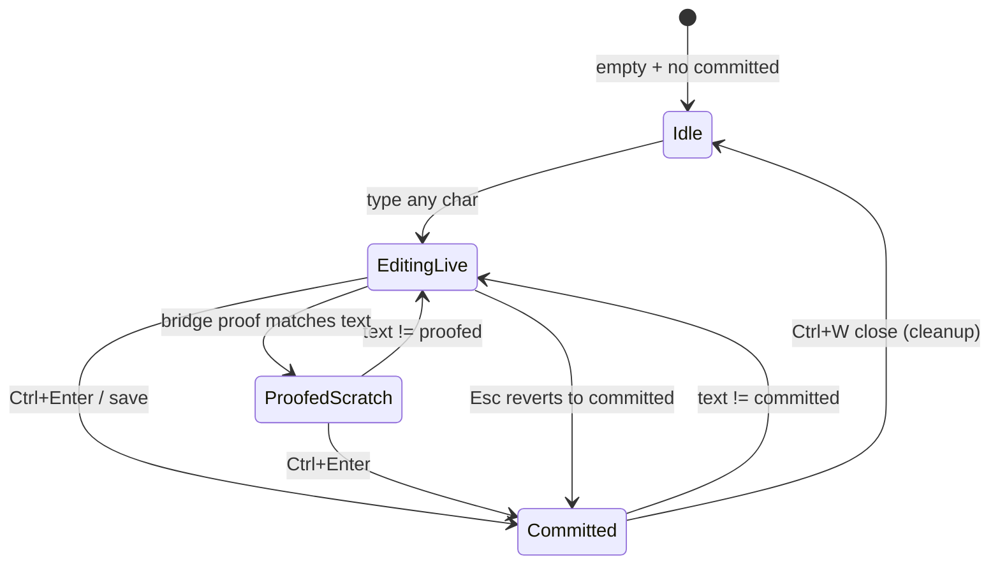
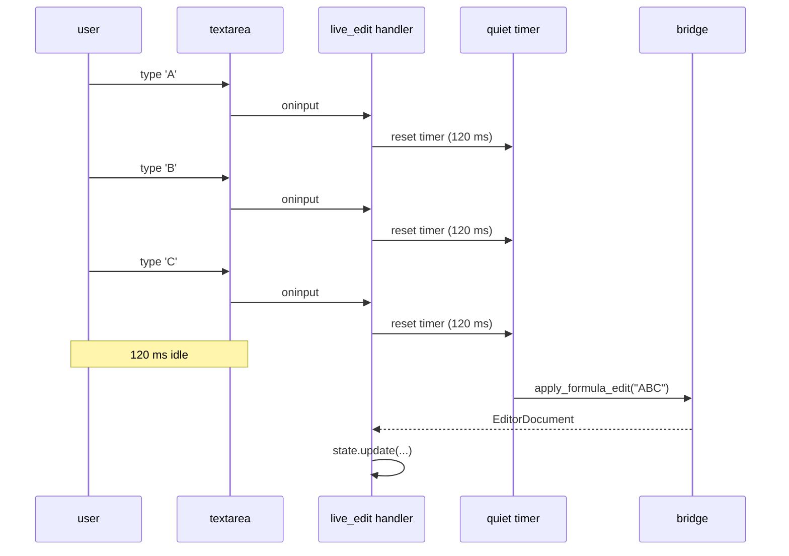

# WS14_DESIGN_FORMULA_EDITOR — Targeted area design

> **Document role.** Targeted design for the WS-14 formula editor. The
> formula editor is the highest-risk WS-14 surface (four interactive
> regressions during WS-13). This document carries the design from
> **requirements → test design → phased implementation**, with explicit
> traceability between requirements and tests so the area can be implemented
> phase-by-phase without re-litigation.
>
> **Read alongside:**
> - [APP_UX_REALIZATION.md](APP_UX_REALIZATION.md) — overall WS-14 realization map
> - [APP_UX_REALIZATION.md §4.1](APP_UX_REALIZATION.md#41-editor-hero--editor_herors) — editor-hero view-model contract
> - [`ui/editor/state.rs`](../src/dnaonecalc-host/src/ui/editor/state.rs) — preserved editor model
> - [`ui/editor/commands.rs`](../src/dnaonecalc-host/src/ui/editor/commands.rs) — preserved keymap
> - [`ui/editor/render_projection.rs`](../src/dnaonecalc-host/src/ui/editor/render_projection.rs) — preserved syntax projection
> - [`adapters/oxfml/types.rs`](../src/dnaonecalc-host/src/adapters/oxfml/types.rs) — preserved bridge mirror types
>
> **Status.** `area_design_v1` · 2026-04-26 · authoritative for the
> editor-hero phase of WS-14 implementation.

---

## 0. Reading guide

| § | Content | When to read |
|---|---|---|
| [§1](#1-why-this-is-high-risk) | Why this is high-risk | Onboarding |
| [§2](#2-design-principles) | Design principles | Always |
| [§3](#3-requirements) | **Requirements (FR / NFR / A11Y / BC)** | Spec input |
| [§4](#4-architectural-decisions) | Architectural decisions | First impl pass |
| [§5](#5-component-anatomy) | Component anatomy + DOM + z-stack | Layout work |
| [§6](#6-behaviors) | Behaviors (text editing, chord map, modes) | Behavior implementation |
| [§7](#7-overlays) | Overlay surfaces (syntax, diagnostics, popup, …) | Overlay implementation |
| [§8](#8-live-bridge-orchestration) | Live-bridge orchestration | Wiring the engine |
| [§9](#9-performance-budgets) | Performance budgets | Tuning |
| [§10](#10-test-design) | **Test design + traceability matrix** | Test gates |
| [§11](#11-implementation-phases) | **Phased implementation** | Each phase |
| [§12](#12-risk-register) | Risk register | Always |
| [§13](#13-open-questions) | Open questions | Roadmap input |

---

## 1. Why this is high-risk

The formula editor is the surface where everything an Excel-like product
*feels* like collides:

1. **Native browser behavior must remain native.** Selection, IME, undo/redo,
   clipboard, OS-level shortcuts, screen-reader integration are all the
   browser textarea's responsibility. Any custom editor (contenteditable
   tricks, virtual caret) loses some of these and re-introduces them as
   subtle bugs forever.
2. **Custom presentation must overlay without stealing input.** Syntax
   coloration, diagnostic squiggles, completion popups, signature help, and
   bracket highlights all sit on top of the textarea. Each is a chance to
   capture a click, swallow a keystroke, or misalign with the caret.
3. **Live engine round-trip must be debounced and cached.** Every keystroke
   could fire an OxFml call. Wrong debouncing → stutter. No debouncing →
   bridge thrash. No cache → reuse animation lies.
4. **Caret round-trips kill UX.** Arrow keys must move the caret natively;
   round-tripping through reducer + view-model rebuild + DOM update produces
   visible lag (~30–80 ms, perceptible). WS-13 hit this.
5. **Overlay positioning is browser-fragile.** Caret position in
   pixel-coordinates depends on font metrics, padding, line-height, scroll,
   browser zoom, and DPR. We must measure, not estimate.
6. **WS-13 reset history.** Phase A of WS-13 already collapsed back to the
   minimal textarea + test foundation precisely because of these traps. WS-14
   must add features back **in test-gated order**, never re-introducing the
   regressions that triggered the reset.

The combination — a real product feel, native behavior, lib-driven
intelligence, and animation — means failures compound. This document exists
to make every behavior explicit and every regression detectable.

---

## 2. Design principles

The guard rails. Every decision below derives from one of these.

| ID | Principle | Why |
|---|---|---|
| P-1 | **Native textarea is the input surface.** Not Monaco, not Codemirror, not contenteditable. | Cheapest correct path to native selection / IME / undo / a11y. |
| P-2 | **The textarea owns input; overlays own presentation.** All overlay layers carry `pointer-events: none`. | Overlay layers cannot capture clicks or keystrokes the textarea expects. |
| P-3 | **Caret moves are not round-tripped.** Arrow keys, Home, End, click-to-position never go through the reducer. | Reducer round-trip is ≥ 30 ms; native is < 1 ms. The user feels every ms. |
| P-4 | **Measurement is browser-truth.** Caret box, line height, character width come from real `getBoundingClientRect` / `Range` measurement, not estimates. | Browser zoom, DPR, fonts, ligatures all break estimation. |
| P-5 | **Bridge is debounced and idempotent.** Multiple keystrokes inside the auto-proof quiet interval coalesce to one bridge call. | Bridge thrash kills throughput and animation correctness. |
| P-6 | **Local fallback before SEAM.** When the bridge returns an error, the editor stays usable with locally-tokenized syntax + locally-classified entry mode + no diagnostics; truth-source flips to `LocalFallback`. | Honest degradation per CHARTER §4. |
| P-7 | **Reduced motion is honored.** Every animation has a `prefers-reduced-motion` 0 ms branch. | A11y; user preference. |
| P-8 | **Every interactive surface has a test that asserts a DOM-visible invariant.** Test-by-snapshot is not enough — invariants are explicit. | WS-13's regression budget would have been zero with this rule. |

---

## 3. Requirements

Each requirement carries an ID. Tests in [§10](#10-test-design) reference
these IDs. Phases in [§11](#11-implementation-phases) close them in order.

### 3.1 Functional requirements (FR-)

#### Text editing primitives (textarea-owned)

| ID | Requirement |
|---|---|
| FR-EDIT-001 | Type any character → inserted at caret natively (no reducer round-trip). |
| FR-EDIT-002 | Backspace at offset N>0 → previous character removed; caret at N−1. |
| FR-EDIT-003 | Delete at offset N<len → next character removed; caret stays at N. |
| FR-EDIT-004 | Plain Enter (no popup visible) → `\n` inserted; caret +1. |
| FR-EDIT-005 | Arrow keys → caret moves natively, no reducer call. |
| FR-EDIT-006 | Selection (drag, shift+arrow, Cmd+A) → native selection. |
| FR-EDIT-007 | Cut (Ctrl+X) / Copy (Ctrl+C) / Paste (Ctrl+V) → native clipboard. |
| FR-EDIT-008 | Undo (Ctrl+Z) / Redo (Ctrl+Y) → native textarea history. |
| FR-EDIT-009 | Tab (no popup) → 2 spaces inserted at caret. |
| FR-EDIT-010 | Shift+Tab (no popup) → 2 spaces removed before caret if present, else no-op. |
| FR-EDIT-011 | F2 → toggle whole-formula select / caret-at-end. |
| FR-EDIT-012 | F4 (caret in/next to a reference) → cycle reference form `A1 → $A$1 → A$1 → $A1`. |
| FR-EDIT-013 | F9 (selection non-empty) → fire SEAM-OXFML-PARTIAL-EVAL with the selection span. |
| FR-EDIT-014 | Ctrl+Space → force completion popup open. |
| FR-EDIT-015 | Ctrl+Shift+U → toggle expanded editor height. |
| FR-EDIT-016 | Ctrl+Enter → commit entry: `committed_cell_text := raw_entered_cell_text`; mark save point. |
| FR-EDIT-017 | Esc (no popup, dirty) → cancel entry: revert `raw_entered_cell_text` to last committed. |
| FR-EDIT-018 | Esc (no popup, clean) → no-op. |
| FR-EDIT-019 | Esc (popup visible) → dismiss popup; do not cancel. |
| FR-EDIT-020 | Spell-check disabled on textarea (`spellcheck="false"`). |

#### Entry-mode classification

| ID | Requirement |
|---|---|
| FR-ENTRY-021 | Empty textarea → entry mode `Empty`; pill renders `Empty`. |
| FR-ENTRY-022 | First char `=` → entry mode `Formula`; pill renders `Formula`. |
| FR-ENTRY-023 | First char `'` (apostrophe) → entry mode `Text`; pill renders `Text`. |
| FR-ENTRY-024 | First char other (non-empty) → entry mode `Value`; pill renders `Value`. |

#### Syntax overlay

| ID | Requirement |
|---|---|
| FR-SYNTAX-025 | When bridge response is current, syntax tokens come from `EditorSyntaxSnapshot.tokens` via `syntax_runs_from_snapshot`. |
| FR-SYNTAX-026 | When bridge response is stale (text differs), fall back to `syntax_runs_from_text` local tokenizer. |
| FR-SYNTAX-027 | Token roles render with assigned colors: Operator (muted), Function (teal), Number (moss), Delimiter (muted), Identifier (ink), Text (rust). |
| FR-SYNTAX-028 | Overlay layer is `pointer-events: none` and aligned to the textarea grid (same font, padding, line-height). |
| FR-SYNTAX-029 | Overlay updates ≤ 16 ms after text change. |

#### Diagnostic squiggles

| ID | Requirement |
|---|---|
| FR-DIAG-030 | A `LiveDiagnostic { span_start, span_len, message, severity }` renders a wavy underline over `span_start..span_start+span_len`. |
| FR-DIAG-031 | Color encodes severity: terracotta = Error, amber = Warning, teal = Info. |
| FR-DIAG-032 | Hover squiggle ≥ 200 ms → tooltip with `diagnostic_id: message` (and `[stage]` chip if known). |
| FR-DIAG-033 | Click squiggle → opens formula drill, scrolls drill to the matching node, focuses drill row. |
| FR-DIAG-034 | When bridge response is stale, no squiggles render (better than wrong squiggles). |

#### Completion popup

| ID | Requirement |
|---|---|
| FR-COMP-035 | Popup anchored below-left of caret using browser-measured caret box. |
| FR-COMP-036 | Width 280 px; max 8 visible rows; scroll for more. |
| FR-COMP-037 | Each row: kind glyph, name (mono), arity (mono muted), one-line summary (sans). |
| FR-COMP-038 | Up/Down → navigate rows (cycle at top/bottom). |
| FR-COMP-039 | Tab or Enter → accept selected row, dismiss popup, fire bridge call with replaced text. |
| FR-COMP-040 | Esc → dismiss popup, caret unchanged. |
| FR-COMP-041 | Click row → accept that row. |
| FR-COMP-042 | Auto-open: when `completion_aggressiveness == OnIdentifier` and caret is on / just after an identifier; or `Always`. |
| FR-COMP-043 | Force open: Ctrl+Space (regardless of aggressiveness). |
| FR-COMP-044 | Edge: caret near viewport bottom → flip popup to above-left of caret. |
| FR-COMP-045 | Edge: caret near viewport right → clamp popup so it stays in viewport. |
| FR-COMP-046 | Popup persists across syntax-only re-evaluations (no flicker). |

#### Signature help

| ID | Requirement |
|---|---|
| FR-SIG-047 | When `function_help` and `signature_help` are present and caret is in a call, render an above-left tooltip showing the signature. |
| FR-SIG-048 | Active argument index (from `SignatureHelpContext.active_argument_index`) renders bold. |
| FR-SIG-049 | Non-interactive: no focus, no `pointer-events`. |
| FR-SIG-050 | Fades out 80 ms when caret leaves the call (or call closes). |

#### Function help hover

| ID | Requirement |
|---|---|
| FR-HOVER-051 | Hover an identifier in the textarea ≥ 400 ms → render a tooltip with the function's `display_name`, first signature, short description (from `FunctionHelpPacket`). |
| FR-HOVER-052 | Shift-click identifier → open formula drill, scroll to matching walk node. |
| FR-HOVER-053 | Tooltip dismisses on mouseleave or after 4 s. |

#### Bracket pair highlight

| ID | Requirement |
|---|---|
| FR-BRACK-054 | Caret immediately after `(` `)` `{` `}` `[` `]` → render soft teal box at 0.15 opacity over both characters. |
| FR-BRACK-055 | Use `bracket_matcher.rs::bracket_pair_for_caret`; respects string literals and nesting. |
| FR-BRACK-056 | Box updates < 16 ms on caret move. |

#### Cross-highlight (formula drill ⇄ editor)

| ID | Requirement |
|---|---|
| FR-CROSS-057 | Hover a formula-drill walk row → editor dims non-span text to 60% opacity AND renders a teal highlight box over the node's source span. |
| FR-CROSS-058 | Mouseleave drill row → dim restored, highlight removed. |
| FR-CROSS-059 | Click drill row → editor selects the span, focus moves to editor, drill stays open. |

#### Live-bridge orchestration

| ID | Requirement |
|---|---|
| FR-LIVE-060 | Text-change triggers a bridge call after `auto_proof_quiet_interval_ms` of inactivity. |
| FR-LIVE-061 | Bridge response with `text_change_range` aligned to current text → state mutation; otherwise discard (stale). |
| FR-LIVE-062 | Bridge error → `truth_source := LocalFallback`; status-foot dot flips amber; editor remains usable. |
| FR-LIVE-063 | Successful bridge call → `truth_source := LiveBacked`; status-foot dot is sage. |
| FR-LIVE-064 | Reuse animation: when `FormulaEditReuseSummary.reused_green_tree == true`, status-foot green-tree-key area flashes teal for 140 ms. |
| FR-LIVE-065 | Caret moves and selection changes do NOT trigger bridge calls. |
| FR-LIVE-066 | Completion navigation (Up/Down) does NOT trigger bridge calls. |

#### Editor-foot metrics chip

| ID | Requirement |
|---|---|
| FR-METRICS-067 | Chip text: `tokens N · functions M · refs K · status` where `status ∈ {clean, N issues, incomplete}`. |
| FR-METRICS-068 | `tokens` ← `EditorSyntaxSnapshot.tokens.len()`. |
| FR-METRICS-069 | `functions` ← count of `SyntaxRun.role == Function`. |
| FR-METRICS-070 | `refs` ← `BindSummary.reference_count`. |
| FR-METRICS-071 | `status == incomplete` when any token has `SyntaxKind::MissingExpr`. |
| FR-METRICS-072 | `status == N issues` when diagnostics non-empty. |
| FR-METRICS-073 | `status == clean` otherwise. |

### 3.2 Non-functional requirements (NFR-)

| ID | Requirement |
|---|---|
| NFR-PERF-001 | Keystroke → DOM update for native edit ≤ 16 ms p99. |
| NFR-PERF-002 | Keystroke → bridge dispatch (debounced) ≤ 50 ms p50, ≤ 120 ms p99. |
| NFR-PERF-003 | Bridge response → DOM update ≤ 16 ms. |
| NFR-PERF-004 | First mount → first paint ≤ 80 ms (excluding first bridge call). |
| NFR-PERF-005 | Caret-only events ≤ 1 ms (no JS overhead). |
| NFR-PERF-006 | Completion popup open → first frame ≤ 80 ms. |
| NFR-PERF-007 | Resize / scroll → overlay re-anchor ≤ 16 ms (60 fps). |
| NFR-MEM-008 | Editor state per formula space ≤ 100 KB. |
| NFR-MOTION-009 | All editor animations honor `prefers-reduced-motion: reduce` (0 ms duration). |
| NFR-DETER-010 | Same input + same state → identical DOM (no random ordering, no time-based variance in attributes). |

### 3.3 Accessibility requirements (A11Y-)

| ID | Requirement |
|---|---|
| A11Y-001 | Textarea has `aria-label="formula editor"`. |
| A11Y-002 | Textarea has `spellcheck="false"`, `autocomplete="off"`, `autocorrect="off"` (Safari), `autocapitalize="none"`. |
| A11Y-003 | Completion popup is `role="listbox"`; rows are `role="option"` with `aria-selected`. |
| A11Y-004 | Signature help is `role="status"` with `aria-live="polite"`; updates announced when content changes. |
| A11Y-005 | Diagnostics list is rendered into an `aria-live="polite"` region; only message text is announced (not span). |
| A11Y-006 | Every SEAM badge in the editor surface carries `aria-describedby` with its SEAM id. |
| A11Y-007 | Visible focus ring: 2 px solid teal on the textarea AND on every interactive overlay element. |
| A11Y-008 | Tab order spatially: textarea → editor-foot drill toggle → editor-foot metrics chip → result hero. |
| A11Y-009 | Esc unwinds in predictable order: completion popup → cancel-dirty-edit → blur. |
| A11Y-010 | Color contrast ≥ 4.5:1 for body text against background; ≥ 3:1 for non-text UI. |

### 3.4 Browser-compatibility requirements (BC-)

| ID | Browser / Engine | Coverage |
|---|---|---|
| BC-001 | Chromium (Edge / Chrome / Brave) latest on Windows | Full |
| BC-002 | Chromium latest on macOS | Full |
| BC-003 | Chromium latest on Linux | Full |
| BC-004 | Firefox latest on Windows | Full (note `Ctrl+E` collides with Find — see [§13](#13-open-questions)) |
| BC-005 | Firefox latest on macOS | Full |
| BC-006 | Safari latest on macOS | Full (especially IME composition) |
| BC-007 | Tauri webview (WebKit on macOS, WebView2 on Windows) | Parity with native browser per OS |
| BC-008 | DPR variation (1×, 1.5×, 2×, 3×) | Caret-box measurement correct |
| BC-009 | Browser zoom 75% / 100% / 125% / 150% / 200% | Caret-box measurement correct; popup re-anchors |

### 3.5 Out of scope

- **Multiline formula formatting / pretty-printing.** WS-14 ships unformatted
  source; auto-format is later.
- **Search/replace within formula.** Native textarea has no `Ctrl+F`; we
  don't add one. A formula is short enough to scan.
- **Refactor / rename.** Not a WS-14 surface.
- **Multiple formula spaces in DOM at once.** Per WS-14 plan §1.3, one
  active scenario; no split view.
- **Mobile / touch input.** WS-14 plan §16 punted mobile.
- **Chord recording / vim mode / emacs mode.** No.

---

## 4. Architectural decisions

| ID | Decision | Reasoning |
|---|---|---|
| AD-1 | **Native `<textarea>` as the input surface.** | P-1, P-2. Cheapest correct path; preserves all native behaviors. |
| AD-2 | **Overlay layers stacked above textarea with `pointer-events: none`.** | P-2. Textarea owns input; overlays cannot interfere. |
| AD-3 | **Syntax overlay is a positioned `<pre>` with same font/padding/line-height as the textarea, mirroring its scroll.** | P-4. Pixel-perfect alignment without JS positioning per token. |
| AD-4 | **Caret box is browser-measured via `Range.getClientRects()` on a hidden mirror element**, not estimated from char count × char width. | P-4. Robust against zoom, DPR, ligatures, line wraps (we still don't wrap, but the measurement is robust). |
| AD-5 | **Caret-only events skip the reducer.** Native input handlers update the DOM only; reducer is only invoked on text-changing events or commands. | P-3, P-5. |
| AD-6 | **Live-bridge dispatcher is debounced via `auto_proof_quiet_interval_ms`** (default 120 ms). Text changes during the quiet window collapse to a single bridge call after the window expires. | P-5. |
| AD-7 | **Bridge response carries `text_change_range`**; stale responses are dropped. | P-5. Out-of-order responses don't corrupt state. |
| AD-8 | **Completion popup state is split: list source (bridge) + selection (local).** Up/Down navigation never touches the bridge. | P-5. |
| AD-9 | **Cross-highlight uses a shared `RwSignal<Option<HoveredNodeId>>`** read by both editor and formula drill. | Local UI state; no reducer involvement. |
| AD-10 | **Local fallback path**: when bridge fails, derive `syntax_runs` from `syntax_runs_from_text`, set `truth_source := LocalFallback`, suppress diagnostics. | P-6. |
| AD-11 | **All overlay updates are recomputed each render**; no diffed DOM patches. With the small state size and Leptos reactivity, this is fast and avoids drift bugs. | NFR-PERF-007, simplicity. |

---

## 5. Component anatomy

### 5.1 DOM structure

```
<section class="editor-section">
  <div class="caption">…</div>

  <div class="editor-hero" data-expanded="false">
    <div class="editor-hero__gutter">…</div>

    <div class="editor-hero__pane">
      <pre class="editor-hero__syntax"   aria-hidden="true">…syntax runs…</pre>
      <div class="editor-hero__diagnostics" aria-hidden="true">…squiggles…</div>
      <div class="editor-hero__brackets"    aria-hidden="true">…bracket boxes…</div>
      <div class="editor-hero__crosshl"     aria-hidden="true">…cross-highlight box…</div>
      <textarea class="editor-hero__textarea"
                spellcheck="false" autocomplete="off"
                autocorrect="off" autocapitalize="none"
                aria-label="formula editor"></textarea>
      <div class="editor-hero__caret-mirror" aria-hidden="true">…hidden mirror for caret measurement…</div>

      <div class="completion-popup" role="listbox" data-open="false">…</div>
      <div class="signature-help"   role="status"  aria-live="polite">…</div>
      <div class="function-hover-tooltip">…</div>
    </div>
  </div>

  <div class="editor-foot">
    <button class="drill-toggle">…</button>
    <span class="metrics-chip">…</span>
  </div>

  <!-- live regions for a11y -->
  <div class="sr-only" aria-live="polite">…diagnostic announcements…</div>
</section>
```

### 5.2 z-stack (front-to-back inside `.editor-hero__pane`)

```
z=70  function-hover-tooltip       (mouse-driven, transient)
z=60  signature-help               (above-left of caret in call)
z=50  completion-popup             (below-left of caret)
z=40  caret-mirror (hidden)        (visibility: hidden; size: 0)
z=30  textarea                     (transparent caret/selection over content; visible caret)
z=20  cross-highlight box          (pointer-events: none)
z=10  bracket-pair box             (pointer-events: none)
z= 5  diagnostics                  (pointer-events: auto for hover; tiny squiggle elements only)
z= 0  syntax overlay <pre>         (pointer-events: none)
```

The textarea sits **between** the syntax overlay and the popups. The
textarea's text color is **transparent** so the syntax overlay shows through;
the caret and selection are still rendered by the textarea itself (browsers
draw caret/selection above text color).

### 5.3 Measurement model

We measure once after layout (`requestAnimationFrame`) and again on relevant
mutations:

| Measurement | Source | When |
|---|---|---|
| `char_width_px` | Width of a single mono `0` character in a hidden mirror sized to the textarea's font. | Mount; font/zoom change. |
| `line_height_px` | Computed style of the textarea or mirror (`getComputedStyle`). | Mount; font change. |
| `caret_box` | `Range.getClientRects()` from a mirror element with the same text up to the caret. | Per caret move. |
| `selection_box` | Same as caret_box across selection. | Per selection change. |
| `completion_anchor_box` | Same as caret_box but at completion anchor offset. | Popup open / caret move while open. |
| `popup_box` | `getBoundingClientRect()` of the popup itself (for clamping). | Popup open / resize. |
| `viewport` | `window.innerHeight`, `innerWidth`. | Mount; resize. |

These are the existing `EditorMeasuredOverlayBox` and
`EditorOverlayMeasurementEvent` types in
[`ui/editor/geometry.rs`](../src/dnaonecalc-host/src/ui/editor/geometry.rs).
The new editor-hero component continues to fire
`EditorOverlayMeasurementEvent` on each measured update.

---

## 6. Behaviors

### 6.1 Text editing (textarea-owned)

The textarea is wired to a single `oninput` handler that emits an
`EditorInputEvent { text, selection_start, selection_end, input_kind, inserted_text }`.
The handler:

1. Reads `textarea.value`, `textarea.selectionStart`, `textarea.selectionEnd`.
2. Classifies `input_kind` from `event.inputType` (per HTML5 InputEvent spec).
3. Emits the `EditorInputEvent`.

The reducer applies the new `text` to `formula_space.raw_entered_cell_text`,
recomputes `editor_surface_state`, fires the bridge call (debounced).

**Caret-only events** (arrows, Home, End, click positioning) do **not** emit
input events. They emit a `selectionchange` event which the editor handles
locally (updates `editor_surface_state.caret` for downstream measurements,
no reducer call).

### 6.2 Editor-owned chord map

Per [`commands.rs::keydown_to_command`](../src/dnaonecalc-host/src/ui/editor/commands.rs).
WS-14 changes:

| Chord | Pre-WS-14 | WS-14 |
|---|---|---|
| `Ctrl+Enter` | `RequestProof` | **`CommitEntry`** |
| `Ctrl+Alt+I` | `SendSelectionToInspect` | **removed** |
| `Ctrl+D` | (n/a) | **`ToggleFormulaDrill`** (new) |
| `Ctrl+R` | (n/a) | **`ToggleResultDrill`** (new) |
| `Ctrl+E` | (n/a) | **`EnterCompare`** (new) |

All other chords preserved verbatim. The full table is in [APP_UX_REALIZATION §4.1](APP_UX_REALIZATION.md#41-editor-hero--editor_herors).

### 6.3 Entry-mode classification

Pure function on the text:

```rust
fn classify_entry_mode(text: &str) -> EditorEntryMode {
    let mut chars = text.chars();
    match chars.next() {
        None => EditorEntryMode::Empty,
        Some('=') => EditorEntryMode::Formula,
        Some('\'') => EditorEntryMode::Text,
        Some(_) => EditorEntryMode::Value,
    }
}
```

### 6.4 Live-state machine

Per [`ui/editor/state.rs::EditorLiveState`](../src/dnaonecalc-host/src/ui/editor/state.rs).
The four states drive the breadcrumb dirty marker and editor border accent:



### 6.5 Commit / cancel / proof

- **`CommitEntry`** (Ctrl+Enter): set `committed_cell_text := raw_entered_cell_text`, `proofed_cell_text := raw_entered_cell_text`. No bridge call (auto-proof has already happened). Breadcrumb dirty flag clears for named scenarios.
- **`CancelEntry`** (Esc, no popup, dirty): set `raw_entered_cell_text := committed_cell_text.clone()`. Single bridge call to refresh syntax/eval against reverted text.
- **`RequestProof`** still exists in the enum but is unbound from a chord (auto-proof handles it). May be invoked programmatically by tests.

### 6.6 Reference-form cycling (F4)

Re-uses [`ui/editor/reference_cycle.rs::cycle_reference_form`](../src/dnaonecalc-host/src/ui/editor/reference_cycle.rs).
The function takes `(text, start, end)` and returns the rewritten text.
F4 with no selection: identifies the reference token containing the caret
and selects it, then cycles.

### 6.7 Selection drill via formula drill

Cross-highlight is shared state:

```rust
// scoped to home_shell.rs
let hovered_node_id: RwSignal<Option<String>> = RwSignal::new(None);
// passed down to both editor_hero and formula_drill props
```

When `formula_drill` writes `Some(node_id)`, `editor_hero` looks up the
node's `source_span` from the formula-drill view-model, computes the
overlay box from `EditorOverlayGeometrySnapshot`, and renders the
cross-highlight box. When `formula_drill` writes `None`, the box is removed.

---

## 7. Overlays

### 7.1 Syntax coloration overlay

A `<pre class="editor-hero__syntax">` positioned exactly over the textarea's
text area, with identical font, padding, and line-height. It contains
`<span>` children per `SyntaxRun`, each with a role-keyed CSS class.

Source of runs:

```
if editor_document.editor_syntax_snapshot.green_tree_key matches current text
    → syntax_runs_from_snapshot(snapshot)
else
    → syntax_runs_from_text(raw_entered_cell_text)
```

The fallback path means **the editor never shows zero-color stale text**:
even when bridge is stale, basic role classification keeps coloration honest.

### 7.2 Diagnostic squiggle overlay

A `<div class="editor-hero__diagnostics">` containing one absolutely
positioned `<span>` per `LiveDiagnostic`. Each `<span>` has:

- top/left = caret-box of `span_start`
- width = `(span_len) × char_width_px`
- bottom border style: `text-decoration: underline wavy <severity-color> 1.5px`
- title attribute = `diagnostic_id: message` (native tooltip fallback if hover-tooltip layer fails)

Hover triggers a teal-bordered tooltip layer (with `pointer-events: auto`
for the hovering span only). Click toggles the formula drill open and
fires a `FormulaDrillFocusIntent { node_id_for_diagnostic }`.

### 7.3 Bracket-pair highlight

A `<div class="editor-hero__brackets">` with two absolutely positioned
boxes. Each box: `1 × char_width_px` wide, `line_height_px` tall, soft
teal background `rgba(36, 93, 90, 0.15)`, rounded 2 px.

Computed from `bracket_matcher::bracket_pair_for_caret(text, caret_offset)`.

### 7.4 Caret-tracked overlay (cross-highlight)

A `<div class="editor-hero__crosshl">` with a single rectangle drawn over
the hovered node's `source_span`. Box geometry comes from the same
measurement infrastructure (`EditorOverlayBox.from_span`). Dim layer is a
sibling `<div>` with `opacity: 0.6` and a transparent cutout over the span
(implemented via box-shadow inset trick or two layers).

### 7.5 Completion popup

A `<div class="completion-popup" role="listbox">`. State:

```rust
struct CompletionPopupView {
    is_open: bool,
    items: Vec<CompletionItemView>,
    selected_index: Option<usize>,    // local; never round-trips
    anchor_box: EditorMeasuredOverlayBox,
    placement: Placement,             // Below | Above
}
```

**Open conditions** (any one):
- `Ctrl+Space` pressed (force open).
- Caret on identifier AND `completion_aggressiveness == OnIdentifier` AND items non-empty.
- `completion_aggressiveness == Always` AND items non-empty.

**Placement:**
- Default: 4 px below `anchor_box.bottom`, left-aligned to `anchor_box.left`.
- If `anchor_box.bottom + popup_height + 4 > viewport.bottom - safe_margin`:
  flip to `anchor_box.top - popup_height - 4`.
- If `anchor_box.left + 280 > viewport.right - safe_margin`:
  clamp `left = viewport.right - 280 - safe_margin`.

**Navigation** (local only):
- Up: `selected_index = (selected_index - 1).max(0)` or wrap.
- Down: `selected_index = (selected_index + 1).min(len-1)` or wrap.
- Tab/Enter: dispatch `EditorCommand::AcceptCompletionByIndex(idx)` →
  bridge call with replaced text.
- Esc: `is_open = false`, `selected_index = None`.

**Type-to-filter:** as the user types, the bridge re-fires (debounced) and
returns a filtered `completion_proposals` list. Local `selected_index` is
preserved if the previously-selected item still exists, else reset to 0.

### 7.6 Signature help

A `<div class="signature-help" role="status">` positioned above-left of
caret. Renders `function_help.signature_forms[0].display_signature` with
the active argument bold (slice the signature on commas to identify the
N-th argument; this is a host-side cosmetic — the lib already classified).

`pointer-events: none` always. Visibility tied to
`signature_help_anchor_offset.is_some() && function_help.is_some()`.

### 7.7 Function help hover

A timer-based tooltip that uses `function_help` data. The trigger is a
hover on an identifier token; we identify the token by hit-testing
`SyntaxRun` boxes. The tooltip is a `<div class="function-hover-tooltip">`
with `pointer-events: auto` so the user can mouse into it.

---

## 8. Live-bridge orchestration

### 8.1 Auto-proof quiet interval

Default `auto_proof_quiet_interval_ms: 120` (per `EditorSettings`). A
text-change event resets the timer; when the timer fires, a bridge call
is dispatched with `analysis_stage: FullSemanticPlan`.



### 8.2 Analysis stage selection

| Trigger | Stage |
|---|---|
| Caret-only event | (no bridge call) |
| Text change inside auto-proof window | (no bridge call yet) |
| Auto-proof window expires | `FullSemanticPlan` |
| `Ctrl+Space` (force completion) | `SyntaxAndBind` (just enough for completion + signature help) |
| Editor mount with non-empty text | `FullSemanticPlan` (one synchronous warm-up call) |

### 8.3 Truth-source projection

```rust
fn project_truth_source(document: &EditorDocument, error: Option<&OxfmlEditorBridgeError>) -> ProjectionTruthSource {
    if error.is_some() { return ProjectionTruthSource::LocalFallback; }
    if document.editor_syntax_snapshot.green_tree_key.is_empty() { return ProjectionTruthSource::LocalFallback; }
    ProjectionTruthSource::LiveBacked
}
```

The status-foot reads `formula_space.context.truth_source` and renders the
dot color (sage = LiveBacked, amber = LocalFallback).

### 8.4 Bridge error handling

Errors from `OxfmlEditorBridgeError::UpstreamFailure(message)` set
`truth_source := LocalFallback`. The editor remains usable with local
syntax tokenization. The error message is shown only in the workspace
settings page and in a status-foot tooltip — never as a modal or banner.

### 8.5 Reuse animation

When `FormulaEditReuseSummary.reused_green_tree == true`, the green-tree-key
chip in the status-foot flashes teal for 140 ms (CSS keyframe). When
`reduced_motion`, no flash.

---

## 9. Performance budgets

| Path | Budget | Measured how |
|---|---|---|
| Native keystroke → DOM update | ≤ 16 ms p99 | Browser perf timer in test |
| Caret-only event | ≤ 1 ms (no JS work) | Browser perf timer |
| Text-change → state update (sync portion) | ≤ 8 ms | Reducer timing in test |
| Auto-proof bridge round-trip (median formula) | ≤ 50 ms p50, 120 ms p99 | Bridge timing histogram |
| Bridge response → DOM update | ≤ 16 ms | rAF profile |
| Mount → first paint (cold) | ≤ 80 ms | Lighthouse / browser perf |
| Completion popup open → first frame | ≤ 80 ms | Browser test |
| Resize / scroll → overlay re-anchor | ≤ 16 ms (60 fps) | Browser test |
| Editor state size per formula space | ≤ 100 KB | Heap snapshot in test |

Budget violations fail the relevant test (T-PERF-*).

---

## 10. Test design

### 10.1 Test layers

| Layer | Crate / file | What |
|---|---|---|
| **Unit** | in-tree `#[cfg(test)]` | Pure functions: `commands.rs`, `bracket_matcher.rs`, `reference_cycle.rs`, `render_projection.rs`, `geometry.rs`, `state.rs` |
| **Integration** | `tests/editor.rs`, new `tests/editor_hero.rs` | Service composition with stub bridge |
| **Browser invariant** | `tests/browser/editor_core.rs` (new wasm-bindgen crate) | DOM-visible invariants in headless Chromium |
| **Browser perf** | `tests/browser/editor_perf.rs` | Timing budgets enforced |
| **Visual regression** | `tests/browser/editor_visual.rs` + screenshot baselines | Snapshot diff at 1440×900, 1024×768, 720×600 |
| **A11y audit** | `tests/browser/editor_a11y.rs` (uses `axe-core`) | WCAG-relevant invariants |

### 10.2 Browser invariant test catalogue

Each test asserts a DOM-visible invariant. Test ID format `T-<area>-NNN`.

#### T-EDIT — text editing primitives

| ID | Setup | Action | Assertion |
|---|---|---|---|
| T-EDIT-001 | Empty editor | `textarea.dispatchEvent('input', value='abc')` | `state.formula_spaces[active].raw_entered_cell_text == "abc"` |
| T-EDIT-002 | `text="abc"`, caret at 1 | Click at offset 2 | `textarea.selectionStart == 2 && selectionEnd == 2` |
| T-EDIT-003 | `text="abc"`, caret at 2 | Press ArrowLeft | `textarea.selectionStart == 1`, no reducer dispatch (assert via spy) |
| T-EDIT-004 | `text="abc"`, caret at 1 | Press ArrowRight | `selectionStart == 2`, no dispatch |
| T-EDIT-005 | `text="ab"`, caret at 2 | Press Enter | `text == "ab\n"`, caret at 3 |
| T-EDIT-006 | `text="ab"`, caret at 2 | Press Backspace | `text == "a"`, caret at 1 |
| T-EDIT-007 | `text="ab"`, caret at 0 | Press Delete | `text == "b"`, caret at 0 |
| T-EDIT-008 | `text=""`, caret at 0 | Press Tab | `text == "  "`, caret at 2 |
| T-EDIT-009 | `text="    foo"`, caret at 4 | Press Shift+Tab | `text == "  foo"`, caret at 2 |

#### T-ENTRY — entry-mode classification

| ID | Setup | Action | Assertion |
|---|---|---|---|
| T-ENTRY-010 | Empty | type `=` | `entry_mode == Formula`; pill `Formula` rendered |
| T-ENTRY-011 | Empty | type `'` | `entry_mode == Text`; pill `Text` rendered |
| T-ENTRY-012 | Empty | type `5` | `entry_mode == Value`; pill `Value` rendered |
| T-ENTRY-013 | `text="=A"`, caret at 2 | Backspace twice | `entry_mode == Empty`; pill `Empty` rendered |

#### T-SYNTAX — syntax overlay

| ID | Setup | Action | Assertion |
|---|---|---|---|
| T-SYNTAX-014 | Type `=SUM(1,2)` | wait for bridge | `<span class="role-fn">SUM</span>` present |
| T-SYNTAX-015 | Bridge stalled | type `=AVG` | local-fallback overlay still renders `AVG` colored |
| T-SYNTAX-016 | Overlay measurement | resize window | overlay re-aligns within 16 ms |

#### T-DIAG — diagnostics

| ID | Setup | Action | Assertion |
|---|---|---|---|
| T-DIAG-017 | Type `=NOSUCH(1)` | wait for bridge | exactly one squiggle, `data-severity="error"` |
| T-DIAG-018 | T-DIAG-017 ground | hover squiggle 250 ms | tooltip visible with `diagnostic_id: ` prefix |
| T-DIAG-019 | T-DIAG-017 ground | click squiggle | formula drill opens, `data-active-node` matches |
| T-DIAG-020 | Bridge stalled | text changes | no squiggles render |

#### T-COMP — completion popup

| ID | Setup | Action | Assertion |
|---|---|---|---|
| T-COMP-021 | `text="=S"`, caret at 2 | wait for bridge | popup visible, `data-open="true"` |
| T-COMP-022 | T-COMP-021 ground | press ArrowDown | `selected_index == 1` (locally), no bridge dispatch |
| T-COMP-023 | T-COMP-021 ground | press Enter | popup closes; selected proposal's `insert_text` is in textarea |
| T-COMP-024 | T-COMP-021 ground | press Esc | popup closes; text unchanged |
| T-COMP-025 | T-COMP-021 ground | click row 2 | row 2's `insert_text` accepted |
| T-COMP-026 | Caret at viewport bottom | open popup | popup placed above caret (`data-placement="above"`) |
| T-COMP-027 | Caret near viewport right | open popup | popup left clamped to fit viewport |
| T-COMP-028 | Resize browser | popup open | popup re-anchors; box position changes within 16 ms |
| T-COMP-029 | Browser zoom 150% | open popup at offset N | popup anchored over caret box (within 1 px) |
| T-COMP-030 | Type `=S`, popup open, type `U` | bridge filter | popup updates; selection preserved if `SUM` still in list |

#### T-SIG — signature help

| ID | Setup | Action | Assertion |
|---|---|---|---|
| T-SIG-031 | Type `=SUM(`, caret in call | wait for bridge | sig help visible, first arg bold |
| T-SIG-032 | Type `=SUM(1,`, caret after comma | wait for bridge | sig help shows arg 2 bold |
| T-SIG-033 | Caret leaves call | move caret | sig help fades (animation 80 ms or 0 ms reduced-motion) |

#### T-HOVER — function help hover

| ID | Setup | Action | Assertion |
|---|---|---|---|
| T-HOVER-034 | `text="=SUM(1)"` | hover `SUM` 450 ms | tooltip visible with display name + signature |
| T-HOVER-035 | T-HOVER-034 ground | shift-click `SUM` | formula drill opens, scrolled to SUM node |

#### T-BRACK — bracket pair

| ID | Setup | Action | Assertion |
|---|---|---|---|
| T-BRACK-036 | `text="=SUM(1)"`, caret at 5 (after `(`) | check overlay | bracket box at offsets 4 and 6 |
| T-BRACK-037 | Move caret to 7 (after `)`) | check overlay | bracket box at offsets 4 and 6 |
| T-BRACK-038 | Move caret to 3 (no bracket) | check overlay | no bracket box |

#### T-CROSS — cross-highlight

| ID | Setup | Action | Assertion |
|---|---|---|---|
| T-CROSS-039 | Drill open | hover walk row | editor `data-cross-highlight="true"`; non-span text dimmed; span box visible |
| T-CROSS-040 | T-CROSS-039 ground | mouseleave drill row | no `data-cross-highlight`; dim removed |

#### T-LIVE — live bridge

| ID | Setup | Action | Assertion |
|---|---|---|---|
| T-LIVE-041 | Empty | type `=SUM(1,2,3)` rapidly | exactly one bridge call after 120 ms quiet (debounced) |
| T-LIVE-042 | Live editor | bridge stub returns Err | `truth_source == LocalFallback`; status-foot dot amber; squiggles suppressed |
| T-LIVE-043 | Live editor | bridge stub returns `reused_green_tree=true` | green-tree-key chip flashes teal |
| T-LIVE-044 | Live editor | press ArrowRight | NO bridge call dispatched (assert via spy) |
| T-LIVE-045 | Live editor | navigate completion popup | NO bridge call dispatched |

#### T-COMMIT — commit / cancel

| ID | Setup | Action | Assertion |
|---|---|---|---|
| T-COMMIT-046 | `text="=A"`, committed=`""` | press Ctrl+Enter | `committed_cell_text == "=A"`; live state == Committed |
| T-COMMIT-047 | `text="=A"`, committed=`"=B"` | press Esc | `raw_entered_cell_text == "=B"`; one bridge call against `"=B"` |
| T-COMMIT-048 | `text=""`, committed=`""` | press Esc | no-op (text unchanged, no bridge call) |
| T-COMMIT-049 | Popup open, dirty | press Esc | popup closes; text NOT reverted |
| T-COMMIT-050 | F2 with text | press F2 | textarea selection covers whole text |

#### T-A11Y — accessibility

| ID | Setup | Action | Assertion |
|---|---|---|---|
| T-A11Y-051 | Editor mounted | inspect textarea attrs | `spellcheck="false"`, `aria-label="formula editor"` |
| T-A11Y-052 | Popup open | inspect listbox | `role="listbox"`, rows `role="option"`, `aria-selected` consistent |
| T-A11Y-053 | Sig help visible | inspect | `role="status"`, `aria-live="polite"` |
| T-A11Y-054 | Tab from textarea | press Tab | focus moves to drill-toggle; visible focus ring (≥ 2 px) |
| T-A11Y-055 | `prefers-reduced-motion: reduce` | open/close popup | computed animation-duration == 0 ms |

#### T-PERF — performance budgets

| ID | Setup | Action | Assertion |
|---|---|---|---|
| T-PERF-056 | Type 100 chars rapidly | measure keystroke→DOM | p99 ≤ 16 ms |
| T-PERF-057 | Idle editor | rAF measurements 1 s | no jank (no frame > 32 ms) |
| T-PERF-058 | Mount editor with text | first paint timing | ≤ 80 ms cold |
| T-PERF-059 | Open completion popup | first frame timing | ≤ 80 ms |
| T-PERF-060 | Editor state size | heap snapshot | ≤ 100 KB per formula space |

#### T-BC — browser compatibility

Each test in T-BC-061..T-BC-070 re-runs the core invariant suite (T-EDIT-*,
T-COMP-*) under a different browser/zoom combination. Implemented as a
parameterized matrix in CI.

### 10.3 Traceability matrix (FR/NFR/A11Y → Tests)

| Requirement | Tests |
|---|---|
| FR-EDIT-001..010 | T-EDIT-001..009 |
| FR-EDIT-011..015 | T-COMMIT-050; manual for F4/F9 in P11 |
| FR-EDIT-016..019 | T-COMMIT-046..049 |
| FR-EDIT-020 | T-A11Y-051 |
| FR-ENTRY-021..024 | T-ENTRY-010..013 |
| FR-SYNTAX-025..029 | T-SYNTAX-014..016 |
| FR-DIAG-030..034 | T-DIAG-017..020 |
| FR-COMP-035..046 | T-COMP-021..030 |
| FR-SIG-047..050 | T-SIG-031..033 |
| FR-HOVER-051..053 | T-HOVER-034..035 |
| FR-BRACK-054..056 | T-BRACK-036..038 |
| FR-CROSS-057..059 | T-CROSS-039..040 |
| FR-LIVE-060..066 | T-LIVE-041..045 |
| FR-METRICS-067..073 | dedicated unit tests + browser test asserting chip text |
| NFR-PERF-001..007 | T-PERF-056..059 |
| NFR-MEM-008 | T-PERF-060 |
| NFR-MOTION-009 | T-A11Y-055 |
| NFR-DETER-010 | DOM-snapshot diff in T-EDIT-* (run twice, assert equal) |
| A11Y-001..010 | T-A11Y-051..055 + axe-core sweep |
| BC-001..009 | T-BC-061..070 matrix |

Every requirement has at least one test ID. Phases close requirements
through tests; no requirement is closed without a green test.

### 10.4 Stub bridge

For integration and browser tests that don't want a live `OxFml` round-trip,
we use a `StubOxfmlEditorBridge` that:

- Returns canned `EditorDocument`s for known input strings (e.g. `"=SUM(1,2,3)"`).
- Echoes the input text into a synthetic syntax snapshot using `syntax_runs_from_text`.
- Surfaces `LiveDiagnostic` objects for inputs containing the literal `NOSUCH(`.
- Counts calls (for assertion in T-LIVE-041, T-LIVE-044).

Lives at `src/dnaonecalc-host/src/adapters/oxfml/stub_bridge.rs` (new,
test-only via `#[cfg(any(test, feature = "test-bridge"))]`).

---

## 11. Implementation phases

Phases are ordered to satisfy two constraints: (a) each phase has independent
exit criteria with green tests; (b) no phase introduces a regression that
cannot be detected by tests written in or before that phase.

| # | Phase name | Scope (FR / NFR / A11Y) | Exit gate (test IDs) | Why this order |
|---|---|---|---|---|
| **P1** | Textarea baseline | FR-EDIT-001..010, FR-EDIT-020, NFR-PERF-001, NFR-PERF-005, A11Y-001..002, A11Y-007 | T-EDIT-001..009, T-A11Y-051 | Native is the foundation; nothing else has UI without it. Re-asserts the WS-13 Phase A baseline. |
| **P2** | Entry-mode + commit/cancel + F2 | FR-ENTRY-021..024, FR-EDIT-011, FR-EDIT-016..019 | T-ENTRY-010..013, T-COMMIT-046..050 | Local-only logic; no bridge required; closes the dirty-flag story. |
| **P3** | Live-bridge orchestration (debounced) | FR-LIVE-060..066, NFR-PERF-002, NFR-PERF-003, NFR-DETER-010 | T-LIVE-041, T-LIVE-044, T-LIVE-045 | Wires the engine; result hero starts updating; foundation for syntax/diag. |
| **P4** | Syntax overlay | FR-SYNTAX-025..029, NFR-PERF-007 | T-SYNTAX-014..016 | First overlay; tests measurement model; visible feedback. |
| **P5** | Local fallback path | FR-LIVE-062, AD-10 | T-LIVE-042, T-SYNTAX-015 | Honest degradation path; shipped before hard dependencies on live. |
| **P6** | Diagnostic squiggles | FR-DIAG-030..034 | T-DIAG-017..020 | Now bridge provides diagnostics; second overlay validates the layer model. |
| **P7** | Bracket pair highlight | FR-BRACK-054..056 | T-BRACK-036..038 | Pure local; uses existing `bracket_matcher.rs`; tests the bracket overlay z-index. |
| **P8** | Editor metrics chip | FR-METRICS-067..073 | unit + DOM assertion | Local + `BindSummary`; visible signal of "incomplete". |
| **P9** | Completion popup | FR-COMP-035..046, A11Y-003, NFR-PERF-006 | T-COMP-021..030, T-A11Y-052 | Hardest. Done after measurement infrastructure proven by P4 + P7. |
| **P10** | Signature help | FR-SIG-047..050, A11Y-004 | T-SIG-031..033, T-A11Y-053 | Lower complexity than completion; reuses anchor logic. |
| **P11** | Reuse animation + green-tree-key chip | FR-LIVE-064 | T-LIVE-043 | Polish on top of P3 wiring. |
| **P12** | F4 / F9 / Ctrl+Shift+U chords | FR-EDIT-012..015 | unit + DOM assertion | Power-user chords; F9 is SEAM only. |
| **P13** | Function help hover | FR-HOVER-051..053 | T-HOVER-034..035 | Async tooltip; shift-click cross-link to drill. |
| **P14** | Cross-highlight (drill ⇄ editor) | FR-CROSS-057..059 | T-CROSS-039..040 | Requires formula drill scaffolding to exist (drill phase of WS-14). |
| **P15** | Reduced-motion + a11y polish + axe sweep | NFR-MOTION-009, A11Y-001..010 | T-A11Y-051..055 + axe pass | Final polish before flipping the feature flag. |
| **P16** | Browser-compat matrix | BC-001..009 | T-BC-061..070 | CI matrix; runs full test suite against each engine. |

**Parallel-safe:** P7, P8, P11, P12 can run in parallel with the popup
work in P9 (different files, different test IDs). P14 depends on the
formula drill component existing; sequenced after the drill's own P-series.

---

## 12. Risk register

| ID | Risk | Probability | Impact | Mitigation |
|---|---|---|---|---|
| R-1 | IME composition during overlay updates produces double-rendered or off-by-one carets. | medium | high | Test on Safari + Japanese IME; use `compositionstart`/`compositionend` events to suppress overlay updates during composition. |
| R-2 | Browser zoom invalidates `char_width_px` and `line_height_px`. | high | medium | Re-measure on `window.resize` and `visualviewport.scale` change events. T-COMP-029 enforces. |
| R-3 | Tab character handling differs (we insert spaces, but pasted content may contain tabs). | medium | low | Tabs are preserved on paste; render width via tab-size CSS; documented in spec. |
| R-4 | Multi-line paste with carriage returns. | medium | low | Normalize `\r\n` and `\r` to `\n` on paste in the input handler. |
| R-5 | Selection across viewport-edge popovers. | low | medium | Popovers have `pointer-events: auto` only on interactive children; selection doesn't see them. |
| R-6 | Bridge call returning different green-tree-key for identical text (non-determinism). | low | high | Bridge is supposed to be deterministic; if observed, NFR-DETER-010 fails CI. |
| R-7 | Completion popup re-fires bridge on every navigation key (regression). | low | medium | T-LIVE-045 explicitly forbids; spy on bridge dispatch in test. |
| R-8 | Syntax overlay desync when text contains tab characters or RTL characters. | medium | medium | Limit RTL to embedded strings; assert overlay alignment in visual regression for tab-containing text. |
| R-9 | Reduce-motion bypassed by hand-coded transitions. | medium | low | All transitions go through a `motion()` helper that respects the media query; lint rule for raw `transition:`. |
| R-10 | Auto-proof timer leaks across formula-space switch. | medium | medium | Timer ownership is per-formula-space; clear on `select_active_formula_space`. |
| R-11 | Pasted very long text hangs the bridge. | low | high | Hard cap on text length sent to bridge (e.g. 16 KB); above that, `truth_source := LocalFallback` permanently for the formula space. |
| R-12 | Overlay alignment off after `prefers-reduced-motion` toggle (CSS reflows). | low | low | Re-measure on media-query change. |

---

## 13. Open questions

1. **Firefox `Ctrl+E` collision with Find.** The plan's Compare-with-Excel
   chord collides. Options: (a) document `Ctrl+Shift+E` as Firefox
   fallback; (b) detect Firefox and rebind. Recommendation: (a) — the
   command palette and the `[Compare with Excel]` button cover the chord
   loss. Requires UX copy update.
2. **Ctrl+Shift+U as expanded-editor toggle on Linux.** Linux X11 binds
   `Ctrl+Shift+U` to Unicode entry by default. Investigate; if it's a
   real conflict, rebind to `F11` (already the IDE convention for
   "expanded view").
3. **Should auto-proof be off by default in browser host?** Browser users
   may share OneCalc on a slow connection where 120 ms debounce + bridge
   call is jarring. Recommendation: keep on, but expose the interval in
   workspace settings.
4. **Function-help hover on touch.** Touch has no hover. Defer per FR
   out-of-scope. If a touch-pad accessibility is needed, fall back to a
   long-press → tooltip pattern; not scoped for WS-14.
5. **Spell-check on user `Value` and `Text` entries.** `=` formulas have
   spellcheck off; should `Text` mode entries (apostrophe-prefixed) turn
   it on? Recommendation: no — consistency wins; the user can paste
   prose elsewhere.

---

## Appendix A — Reviewer's 60-second checklist

A reviewer should be able to confirm in 60 seconds:

1. **Every requirement in [§3](#3-requirements) has a test ID** in the
   traceability matrix [§10.3](#103-traceability-matrix-frnfra11y--tests).
   No row is empty.
2. **Every test ID in the catalogue [§10.2](#102-browser-invariant-test-catalogue)
   is referenced from at least one phase** in the implementation plan
   [§11](#11-implementation-phases). No test is unanchored.
3. **Every phase exits on green tests, not on "feels right".**
4. **The four WS-13 regression patterns are explicitly tested:**
   caret round-trip (T-EDIT-003, T-EDIT-004, T-LIVE-044), overlay
   misalignment (T-COMP-028, T-COMP-029, T-SYNTAX-016), input theft by
   overlay (implicit in T-EDIT-001..009 with overlays mounted),
   bridge thrash (T-LIVE-041, T-LIVE-045).

If those four pass, the formula editor is safe to ship.
